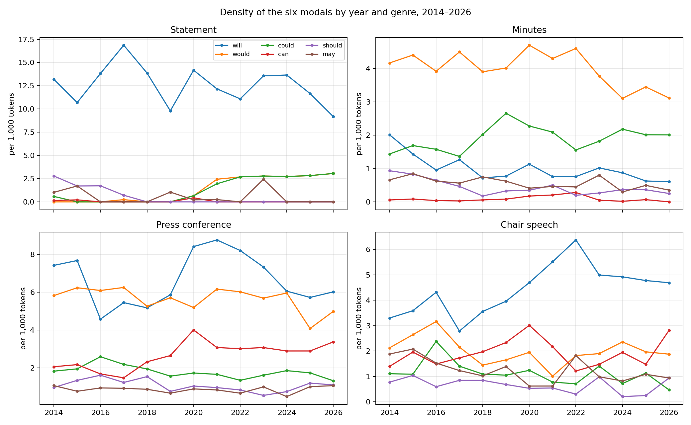
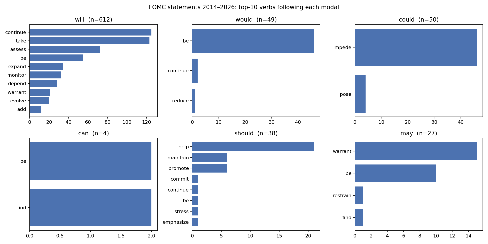
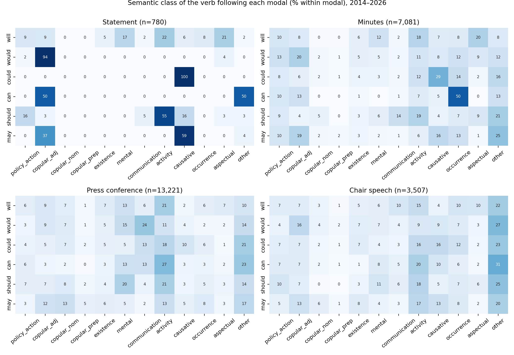
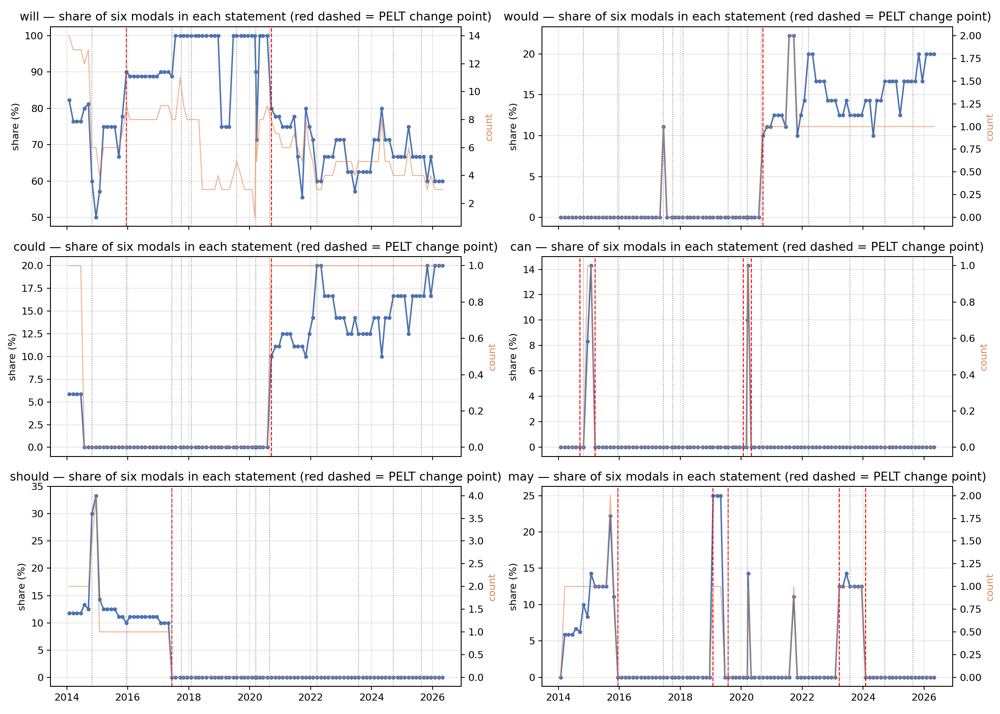
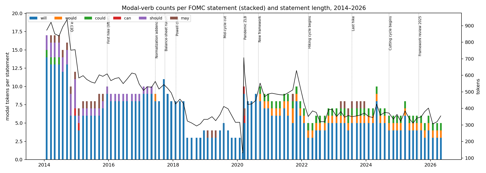
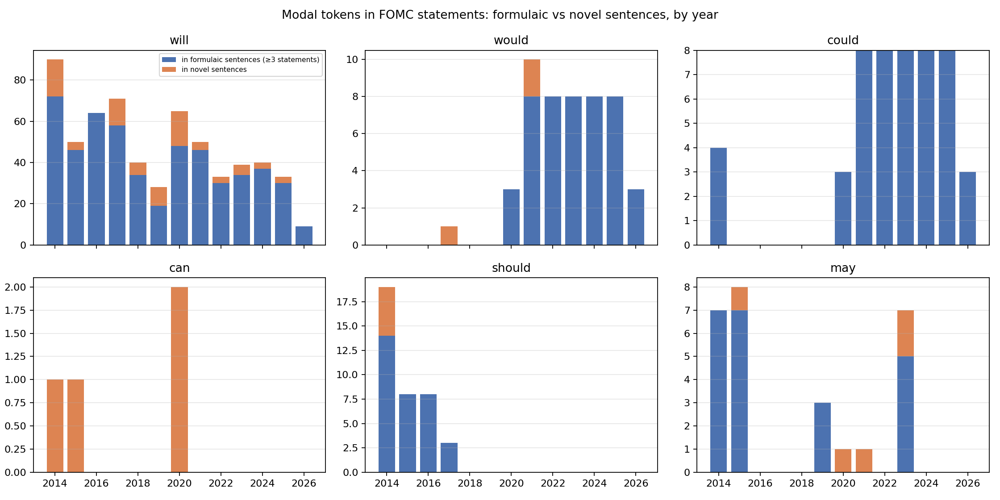
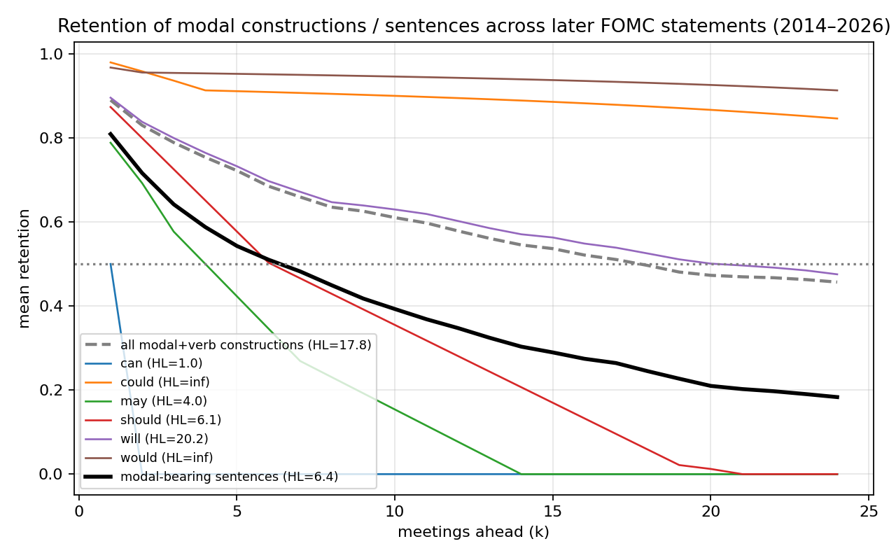
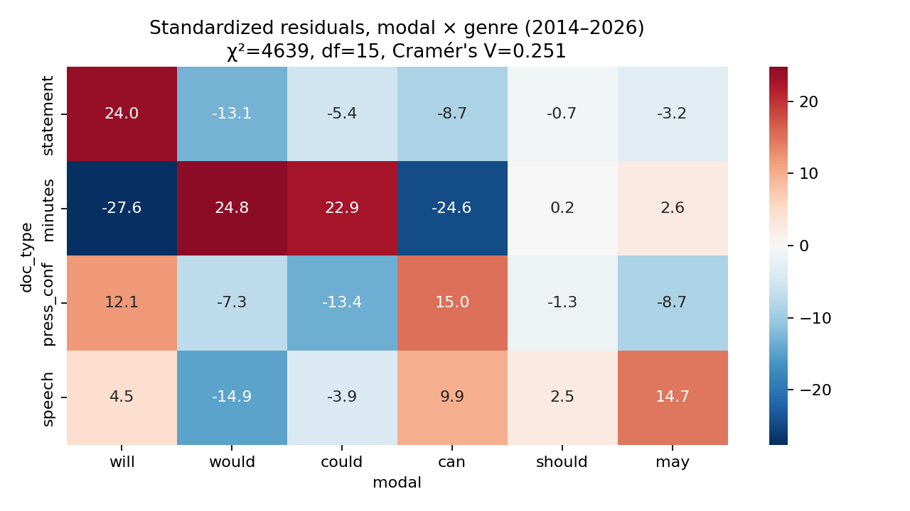
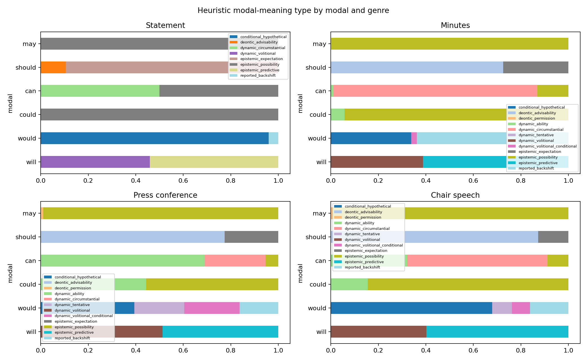

# Abstract

Modal auxiliaries are the grammatical resource with which a central bank calibrates commitment, prediction and possibility. Previous work has treated modality in central-bank text as an aggregate index of hedging or ambiguity. This paper examines instead the *constructions* in which six modals — *will, would, could, can, should, may* — occur in Federal Open Market Committee (FOMC) communication between January 2014 and April 2026: 101 post-meeting statements, 99 sets of minutes, 80 press-conference transcripts and 124 Chair speeches (1.93 million tokens, 24,589 modal tokens). Using dependency-based extraction, distinctive-collexeme analysis, Mann–Kendall trend tests, PELT change-point detection, and survival/retention analysis of modal + verb constructions across consecutive statements, we find that (i) in statements each modal is effectively bound to a single following-verb construction (*will continue/take/assess*, *would be prepared*, *could impede*, *should help maintain*, *may warrant*); (ii) every change point in modal frequency coincides with the insertion or deletion of one identifiable formulaic sentence at a policy-framework event — *should* disappears on 14 June 2017 with the deletion of the reinvestment sentence, *would* and *could* jump from zero to 15% of modal tokens on 16 September 2020 with the conditional-commitment sentence introduced after the revised Statement on Longer-Run Goals; (iii) the density of *will* per 1,000 tokens shows no trend — its falling share is a compositional effect; (iv) 70–100% of modal tokens in statements sit in sentences repeated across three or more meetings, the set of modal constructions present at a given meeting has a retention half-life of 17.8 meetings, and modal-bearing sentences a half-life of 6.4 meetings; and (v) the four genres divide modal labour sharply (χ² = 4,638, Cramér's V = 0.25): *will* for the Committee's procedural commitments in statements, *would/could* for back-shifted reports and risk conditionals in minutes, *can* for ability and negation in press conferences, *may* for epistemic possibility in speeches. We characterise FOMC statement language as *edited formulaicity*: modal statistics are the trace of discrete institutional editing decisions rather than of gradual stylistic drift or cyclical ambiguity, with implications for text-based measures of central-bank tone and uncertainty.

**Keywords:** modal verbs; modality; formulaic language; collostructional analysis; central bank communication; FOMC; change-point detection; corpus linguistics

# 1. Introduction

Since 16 September 2020 every post-meeting statement of the Federal Open Market Committee has contained the sentence *"The Committee would be prepared to adjust the stance of monetary policy as appropriate if risks emerge that could impede the attainment of the Committee's goals."* Before that date, *would* and *could* were virtually absent from the statement genre; after it, each accounts for roughly 15% of the six core modals in every statement. A frequency count of "hedging modals" would register this as a marked and durable increase in tentativeness in Federal Reserve communication. It is nothing of the kind. It is one sentence, adopted once, and carried forward at forty-six consecutive meetings.

This example motivates the present study. Research on central-bank communication has increasingly turned to text as data (Blinder et al., 2008; Bholat et al., 2015; Hansen & McMahon, 2016), and modality has been proposed as a marker of the ambiguity or hedging with which a central bank conveys unfavourable information (Kawamura et al., 2019; Resche, 2004, 2015). In these approaches modal auxiliaries are typically pooled into a single index — "high/low probability" expressions, "hedging devices", or a weighted modality-strength score — and related to the business cycle or to markets. What such indices cannot see is the *construction* level: which verb follows which modal, in which clause type, with which subject, and — crucially for a genre that is drafted by editing the previous meeting's text — for how many meetings the construction survives.

The linguistic literature on the English modals offers the tools for exactly this level of description. Modal auxiliaries are polysemous between epistemic, deontic and dynamic readings (Coates, 1983; Palmer, 1990, 2001; Sweetser, 1990; Depraetere & Reed, 2006), their frequencies have shifted historically in ways that differ by modal and by register (Leech, 2003; Leech et al., 2009; Millar, 2009; Collins, 2009), and their meaning is in large part determined by the lexical verb and the subject with which they combine — an observation formalised in collostructional analysis (Stefanowitsch & Gries, 2003; Gries & Stefanowitsch, 2004). The literature on formulaic language, lexical bundles and register (Wray, 2002; Biber et al., 1999; Biber & Barbieri, 2007) adds that institutional genres are built from recurrent multi-word sequences whose presence or absence is a matter of genre convention rather than of individual choice.

We bring these strands together in a study of six modals in four genres of FOMC communication from 2014 to 2026, a period that spans the end of quantitative easing, the 2015 lift-off, balance-sheet normalisation, the pandemic, the 2020 revision of the Committee's policy framework, the 2022–23 hiking cycle, the 2024 cuts and the 2025 framework review. Our questions are:

- **RQ1** With which verbs does each modal combine, and how sharply do the modals' collocational profiles differ?
- **RQ2** How have the frequencies of the six modals changed between 2014 and 2026, and are the changes gradual trends or discrete steps?
- **RQ3** How persistent are modal constructions in the statement genre — what is their "half-life" across meetings — and what triggers their appearance and disappearance?
- **RQ4** How do the four genres — statement, minutes, press conference, Chair speech — divide the functional labour among the modals?

Our answer is that the modal-verb statistics of FOMC statements are best described as *edited formulaicity*. Modal tokens in statements sit overwhelmingly in sentences that are repeated verbatim across meetings; every detected change point in the frequency of a modal coincides with the insertion or deletion of a single such sentence at a policy-framework event; and each modal is bound to a small set of following-verb constructions that encode distinct functions — unconditional procedural commitment (*will continue/assess/take into account*), conditional commitment (*would be prepared … if*), risk possibility (*could impede*), policy expectation (*should help maintain*), and forward-guidance possibility (*may warrant*). Across genres, the same six modals are redistributed by the communicative situation: back-shifted reporting in minutes, ability and negation in the spontaneous press conference, epistemic possibility in speeches.

The paper makes three contributions. Descriptively, it provides the first exhaustive, construction-level account of modal verbs in FOMC communication across four genres. Methodologically, it introduces survival and retention analysis of constructions across consecutive documents as a way of operationalising the persistence ("half-life") of formulaic language, and combines this with change-point detection to link linguistic change to institutional events. Theoretically, it argues that in heavily edited institutional genres modal frequencies are the trace of discrete drafting decisions, so that text-based indices of tone or uncertainty need to control for formulaic sentences before interpreting variation.

# 2. Background

## 2.1 The semantics of the English modals

The nine central modal auxiliaries of English express three broad families of meaning (Coates, 1983; Palmer, 1990, 2001): *epistemic* modality, concerning the speaker's assessment of the likelihood of a proposition (*inflation may rise*); *deontic* modality, concerning obligation, permission and advisability (*the Committee should be patient*); and *dynamic* modality, concerning ability, volition and circumstantial possibility (*we can be patient*; *the Committee will continue to monitor*). *Will* additionally carries future-time reference and, with an agentive subject, volition or commitment; *would* is its past/hypothetical counterpart and the vehicle of back-shifting in reported speech and of conditional and tentative uses (*I would say*); *could* likewise splits between past ability, hypothetical ability and epistemic possibility (Coates, 1983, ch. 5–7). The reading a modal receives is determined largely by its co-text — the subject, the following verb, negation, conditional marking and embedding (Coates, 1983; Nuyts, 2001; Depraetere & Reed, 2006) — which is why an adequate description must start from the modal + verb construction rather than from the modal alone.

Diachronic corpus work has shown that the modals are not stable in frequency. Between 1961 and 1991 the core modals declined in written British and American English, with *shall, must, ought* and *may* falling steeply, *should* declining, and *will, would, can* and *could* relatively stable (Leech, 2003; Leech et al., 2009). Millar (2009), using *TIME* magazine 1923–2006, found a different pattern for a single, edited publication — *can, could, may* and *will* rising — and argued that genre-internal editorial and stylistic conventions can override community-wide change. Our data allow a complementary test: a single institution, four genres, and a thirteen-year window at meeting-level resolution.

## 2.2 Hedging, modality and central-bank discourse

In the applied-linguistic tradition, modals belong to the repertoire of *hedges* — devices that qualify commitment to a proposition (Hyland, 1996, 1998). Economic forecasting texts are especially rich in modalised claims (Pindi & Bloor, 1987; Donohue, 2006), and central bankers, who are accountable for their forecasts and whose words move markets, hedge systematically (Resche, 2004). Resche (2015), analysing 103 speeches by five central bankers from 2008 to 2013, counted between 4.5% and 5.8% of running words as classical hedging devices (modals, approximators, time restrictors, conjuncts, value judgements), but argued that hedging in central-bank discourse is "diffuse" — a broad rhetorical strategy that includes justification, historical reference and metaphor — so that "trying to measure hedging mathematically would be a vain endeavour" unless co-text and context are taken into account. We accept the critique and respond to it by measuring not the modal but the construction — modal, following verb, subject, conditional marking, embedding — and its persistence.

In economics, Kawamura et al. (2019) conducted a discourse analysis of the Bank of Japan's Monthly Report (1998–2015), classifying sentence-final modal expressions into high-probability, low-probability and "unreal" types by human coding. They found that modal expressions and other markers of ambiguity are counter-cyclical — more frequent when the leading index is low, even controlling for financial-market uncertainty (VIX) — and interpreted this, within a persuasion-game framework, as strategic obfuscation of unfavourable private information. They note that the effect weakens in the English translation and call for tests on the Federal Reserve. Our study responds to that call, but our findings point in a different direction: in FOMC statements the modal profile is determined not by the state of the economy but by discrete institutional decisions about what the statement's standing sentences should say.

## 2.3 Formulaic language, lexical bundles and collostructions

Institutional writing is built from recurrent multi-word sequences. Biber et al. (1999) and Biber & Barbieri (2007) show that *lexical bundles* — frequently recurring sequences such as *take into account the* — are register-specific and serve discourse-organising and stance functions; Wray (2002) argues that formulaic sequences are stored and retrieved whole. FOMC statements are an extreme case: each statement is drafted as a revision of the previous one, so that a large fraction of its sentences are carried over verbatim (Meade & Acosta, 2015). Ehrmann & Talmi (2020) show that the semantic similarity of consecutive Bank of Canada statements is high and that departures from it raise market volatility, suggesting that repetition is itself a communicative choice.

Collostructional analysis (Stefanowitsch & Gries, 2003; Gries & Stefanowitsch, 2004) quantifies the association between a construction slot and the lexemes that fill it, using the Fisher–Yates exact test on a 2 × 2 table of construction × lexeme frequencies. Its distinctive-collexeme variant contrasts semantically similar constructions — here, the six modal + verb frames — to identify the verbs that distinguish them. We use it to characterise the functional profile of each modal (RQ1).

## 2.4 Text analysis of central-bank communication

The economics literature has developed a range of methods for quantifying central-bank text: dictionary-based tone (Loughran & McDonald, 2011), automated similarity and scaling of FOMC statements (Lucca & Trebbi, 2009; Meade & Acosta, 2015), topic models of transcripts and minutes (Hansen & McMahon, 2016; Hansen et al., 2018), text-based estimation of the Fed's objectives (Shapiro & Wilson, 2022), measures of the temporal horizon of communication (Byrne et al., 2023) and even the vocal tone of press conferences (Gorodnichenko et al., 2023). Forward guidance — communication about the future path of policy — is the natural home of modal verbs, and the distinction between *Odyssean* guidance (a commitment) and *Delphic* guidance (a forecast) (Campbell et al., 2012) maps closely onto the grammatical distinction between volitional *will* with the Committee as subject and predictive *will* or epistemic *may/could* with an economic variable as subject. None of this work analyses modal verbs at the level of the construction, and most of it treats the statement as a bag of words or sentences without modelling the editing process that generates it.

## 2.5 Institutional background: how FOMC statements are written

The FOMC statement is a short document (340–840 tokens in our period) released at the end of each of the eight scheduled meetings (plus unscheduled meetings in March 2020). It is drafted by staff on the basis of the previous statement and alternative versions circulated before the meeting, and edited by the Committee; the published minutes record that "members agreed" to particular wording changes. Changes are therefore deliberate, collective and documented. Four events in our window changed standing sentences that carry modals: the completion of asset purchases (October 2014) and lift-off (16 December 2015); the *Addendum to the Policy Normalization Principles and Plans* (14 June 2017), which announced the balance-sheet runoff that began in October 2017 and ended the reinvestment policy; the revised *Statement on Longer-Run Goals and Monetary Policy Strategy* (27 August 2020; Powell, 2020), after which the September 2020 statement was rewritten around the new framework; and the 2025 framework review (22 August 2025). We use these as external anchors for the change points detected in the data.

# 3. Data and methods

## 3.1 Corpus

The corpus comprises all FOMC post-meeting statements, minutes, press-conference transcripts and Chair speeches published on the Federal Reserve Board website from January 2010 to April 2026, collected as plain text with metadata (date, genre, Chair). The analysis window is January 2014 to April 2026; 2010–2013 documents are used only for robustness. Four documents catalogued as statements are not post-meeting statements (a statement on monetary-policy implementation of 11 October 2019, a Board announcement of the FIMA repo facility of 31 March 2020, and the announcements of the 2020 and 2025 framework revisions) and were excluded from the statement series. Text was repaired for encoding artefacts (mis-decoded UTF-8) and sentence-segmented with spaCy (Honnibal & Montani, 2017). Table 1 summarises the corpus.

**Table 1.** Corpus, 2014-01-01 to 2026-04-29.

| Genre | Documents | Tokens | Sentences | Six-modal tokens | per 1,000 tokens |
|---|---:|---:|---:|---:|---:|
| Statement | 101 | 47,351 | 1,816 | 780 | 16.5 |
| Minutes | 99 | 871,758 | 28,473 | 7,081 | 8.1 |
| Press conference | 80 | 697,340 | 35,277 | 13,221 | 19.0 |
| Chair speech | 124 | 313,299 | 13,870 | 3,507 | 11.2 |
| Total | 404 | 1,929,748 | 79,436 | 24,589 | 12.7 |

Speeches are by Chairs Yellen (to January 2018) and Powell. Press-conference transcripts include journalists' questions; we retain them because the modal profile of the question–answer exchange is itself of interest (§4.5), and we flag interrogative sentences.

## 3.2 Extraction of modal constructions

Every token tagged as a modal auxiliary (Penn tag MD), together with the contracted forms *'ll* and *'d* (the latter only when followed by a base-form verb), was extracted with the following attributes derived from the dependency parse: the normalised modal lemma; the *lexical head verb* it scopes over, obtained by skipping auxiliary chains (*would have been able to* → *able*; *could be affected* → *affect*); negation attached to the modal or the verb; passive, perfect and progressive marking; the subject of the clause (head lemma and a nine-way subject type: *Committee*, *Fed*, *we/I*, *person*, *it/there/relative*, *economic variable*, *risks*, *other*, *none*); whether the sentence contains a conditional marker (*if, unless, provided, in the event*); whether the modal clause is embedded under a reporting or mental verb (*noted that … would*, *expects that … will*); and whether the sentence is a question. We restrict the main analysis to the six modals identified as central in the seminar that motivated this study — *will, would, could, can, should, may* — which account for 94% of modal tokens; *might, must* and *shall* are reported in the supplementary tables.

Following verbs were assigned to semantic classes following Biber et al. (1999, ch. 5): activity, communication, mental, causative, occurrence, existence/relationship and aspectual verbs, plus a *policy-action* class (*raise, lower, reduce, maintain, purchase, normalize, …*) specific to the domain. Modal meaning types (epistemic, deontic, dynamic; conditional/hypothetical; reported back-shift) were assigned by rules over modal, subject type, following verb, conditional marking and embedding, following the diagnostics in Coates (1983) and Palmer (1990).

In an author-coded random sample of 60 modal tokens stratified by genre and modal, the lexical head verb was correctly identified in 56 cases (93%); the remaining cases involved quoted material or long coordinated clauses. The heuristic meaning type agreed with the author's judgement in 54 cases (90%). A 200-token validation sample with blank coding columns is distributed with the data for independent double coding.

## 3.3 Following-verb analysis (RQ1)

For each modal and genre we tabulate all following verbs and their within-modal shares, and compute a distinctive-collexeme analysis (Gries & Stefanowitsch, 2004): for each modal *M* and verb *V*, a 2 × 2 table of (*V* with *M*, *V* with other modals; other verbs with *M*, other verbs with other modals) is tested with the Fisher–Yates exact test, and collostruction strength is reported as −log₁₀ *p* signed by attraction (observed > expected) or repulsion. We also compute the Jensen–Shannon divergence (JSD, base 2, range 0–1) between the following-verb distributions of each pair of modals.

## 3.4 Time series (RQ2)

For each document we compute the raw count, the density per 1,000 tokens and the share among the six modals of each modal. Monotonic trends over the meeting-ordered statement series (and over the other genres, with speeches aggregated to quarters) are tested with the Mann–Kendall test and Sen's slope. Structural breaks in the statement series are detected with the PELT algorithm (Killick et al., 2012; Truong et al., 2020) on standardised series, L2 cost, minimum segment length 4 meetings and penalty 2 ln *n*. Persistence is summarised by the AR(1) autocorrelation ρ and the implied half-life ln 0.5 / ln ρ.

## 3.5 Formulaicity, edit events and construction half-lives (RQ3)

Statements are ordered by meeting. Every modal-bearing sentence is normalised (lower-cased, digits replaced) and clustered with earlier sentences at a similarity of ≥ 0.85 (difflib ratio) so that minor numerical or lexical edits do not break identity. A sentence cluster occurring in ≥ 3 statements is *formulaic*; clusters occurring in ≥ 5 statements are listed as boilerplate (Appendix A). *Edit events* are the sentence clusters added or removed between consecutive statements.

Persistence is quantified in three ways. (a) *Cohort survival*: each maximal run of consecutive meetings in which a (modal, head-verb) construction is present defines a cohort; run length is the survival time, right-censored at the end of the sample; Kaplan–Meier (1958) curves and median survival are computed per modal. (b) *Retention*: for each meeting *t* and horizon *k*, the share of the constructions (or modal-bearing sentence clusters) present at *t* that are still present at *t + k*, averaged over *t*; the *retention half-life* is the *k* at which mean retention crosses 0.5. (c) *AR(1) half-life* of the frequency series (§3.4). Measure (a) is sensitive to the many one-off constructions; (b) is the closest to the intuitive notion of how long the modal vocabulary of a statement lasts.

## 3.6 Contexts and genre (RQ4)

Rates of negation, passive, conditional marking, embedding, questions and contraction, and the distribution of subject types and meaning types, are tabulated by modal and genre. The association between genre and modal is tested by χ² with standardised residuals and Cramér's V. Chair (Yellen vs Powell) and policy-phase contrasts (ZLB/taper, hiking I, mid-cycle cuts, pandemic ZLB, hiking II, hold at peak, cuts) are examined within genre.

All code (Python, spaCy 3.7) and derived tables are released with the paper.

# 4. Results

## 4.1 Overview

Figure 1 shows the density of the six modals by year and genre. Three facts are immediately visible. First, density levels are genre-specific: press conferences and statements are the most modal-dense genres (19.0 and 16.5 per 1,000 tokens), minutes the least (8.1). Second, the dominant modal differs by genre — *will* in statements (78% of six-modal tokens), *would* in minutes (50%), *will* and *would* jointly in press conferences (66%), *will* in speeches (35%). Third, the only genre with dramatic within-window redistribution is the statement, where *should* disappears in 2017 and *would* and *could* appear in 2020.

## 4.2 RQ1: Following verbs and collostructional profiles

Table 2 lists, for the pooled corpus, the most frequent following verbs of each modal and the verbs most strongly attracted to and repelled from each modal in the distinctive-collexeme analysis.

**Table 2.** Following verbs of the six modals, all genres pooled, 2014–2026. Collostruction strength = signed −log₁₀ *p* (Fisher exact); ratio = observed/expected.

| Modal (n) | Most frequent following verbs | Most attracted collexemes (ratio, strength) | Most repelled |
|---|---|---|---|
| will (7,558) | be 1,229; continue 608; take 445; have 269; see 186; do 177; assess 171 | continue (2.0, 90.3); take (1.8, 48.7); assess (2.4, 40.9); monitor (2.5, 26.3); watch (3.0, 22.8) | say (−31.4); expect (−18.5); lead; affect |
| would (8,172) | be 1,785; say 694; continue 278; like 235; take 214; expect 164 | say (2.2, 145.5); like (3.0, 111.2); be (1.3, 40.7); expect (2.3, 36.8); want (2.5, 33.9) | do (−26.7); see (−24.8); impede (−17.9) |
| could (3,307) | be 382; impede 162; lead 92; have 91; follow 81; affect 81; help 78 | impede (6.9, 124.3); follow (4.6, 37.7); lead (4.2, 37.4); pose (5.2, 24.5); affect (2.9, 19.0) | say (−38.7); continue (−29.1); be (−21.1) |
| can (2,651) | be 202; do 200; see 115; say 91; give 68; tell 60 | do (3.6, 62.8); tell (4.3, 24.1); give (3.8, 23.0); see (2.4, 18.4); find (4.6, 16.4) | be (−50.3); continue (−23.6); remain (−8.1) |
| should (1,351) | be 191; help 93; continue 40; take 33; do 29; see 26 | help (4.2, 31.9); interpret (13.0, 19.0); affirm (18.2, 17.7); note (8.1, 10.8); acknowledge (16.4, 10.4) | say (−15.7); be (−2.7); depend; warrant |
| may (1,550) | be 434; warrant 64; have 39; need 34; contribute 33 | be (1.6, 27.2); warrant (4.9, 26.7); authorize (14.6, 25.3); contribute (6.8, 19.1); edge (11.6, 17.2) | continue (−15.0); do (−4.9); look (−4.1) |

The profiles are functionally distinct. *Will* attracts the verbs of the Committee's procedural conduct — *continue, take (into account), assess, monitor, watch* — and repels the speech-act and causal verbs. *Would* is the modal of the tentative speech act (*I would say, I would like, I would expect*), the classic hedged performative (Fraser, 1975), and repels verbs of concrete action. *Could* is the modal of adverse causation: *impede, follow, lead (to), pose, affect* — its top collexeme, *impede*, is attracted at 6.9 times its expected frequency. *Can* is the modal of ability and action (*do, tell, give, see, find*) and strongly repels *be* (observed 202 against 455 expected). *Should* attracts *help* and a cluster of cognitive-communicative verbs from press conferences (*interpret, affirm, note, acknowledge, understand*: "you should interpret …", "I should note …"). *May* attracts *warrant* — the forward-guidance idiom *may warrant* — and, from the implementation notes reproduced in minutes, verbs of permission (*authorize, delegate*), the only deontic use of *may* in the corpus.

In statements the picture is far more concentrated (Figure 2). Of 612 tokens of *will*, 125 are followed by *continue*, 123 by *take*, 72 by *assess*, 55 by *be*, 34 by *expand*, 32 by *monitor*, 28 by *depend*. Of 49 tokens of *would*, 46 are *would be (prepared)*. All 50 tokens of *could* are *could impede* (46) or *could pose* (4). Of 38 tokens of *should*, 21 are *should help*, 6 *should maintain*, 6 *should promote*. Of 27 tokens of *may*, 15 are *may warrant* and 10 *may be (appropriate)*. *Can* occurs four times (*can be patient*, *can be found*). The Jensen–Shannon divergence between the following-verb distributions of any two modals in statements is 0.69–1.00 (maximum 1), against 0.20–0.46 in the pooled corpus: in the statement genre each modal is, to a first approximation, one construction.

The semantic-class analysis (Figure 3) sharpens this. In statements, 100% of the verbs following *could* are causative (*impede, pose, affect*), 57% of those following *should* are activity verbs with *help* dominant, 92% of those following *would* are the copula, and the verbs following *will* are spread across activity (21%), aspectual (21%, *continue*), mental (17%, *assess, monitor*) and existence (14%). Across genres the same tendencies hold in weaker form: *could* is the most causative modal everywhere (22% pooled; 29% in minutes), *can* the most activity-oriented (25%), *may* the most copular (33%).

## 4.3 RQ2: Trends and change points, 2014–2026

**Statements.** Table 3 reports the Mann–Kendall tests over the 101 statements. *Would* and *could* increase strongly in both density and share (τ = 0.57 and 0.56, *p* < 0.0001), from zero to about 2.8 per 1,000 tokens and 15.5% of six-modal tokens. *Should* decreases to zero (τ = −0.43). *May* decreases weakly (*p* = 0.015). *Can* shows no trend and is essentially absent. The finding that resolves the first of the seminar's puzzles concerns *will*: its **share** decreases significantly (τ = −0.32, from 0.79 to 0.66), but its **density** does not (τ = −0.09, *p* = 0.21; 12.7 → 12.4 per 1,000 tokens). The decline in *will* is a compositional effect of the arrival of *would* and *could* and of the shortening of the statement (mean length 839 tokens in 2014, 340 in 2026, so that the count of *will* per statement fell from 11 to 3–5 while its density held).

**Table 3.** Mann–Kendall trend tests, FOMC statements 2014–2026 (n = 101 meetings).

| Modal | Density per 1,000: trend (τ, *p*) | Share of six modals: trend (τ, *p*) | Mean, first quarter → last quarter of sample |
|---|---|---|---|
| will | none (−0.09, 0.21) | decreasing (−0.32, < 0.0001) | 12.7 → 12.4 per 1,000; share 0.79 → 0.66 |
| would | increasing (0.57, < 0.0001) | increasing (0.57, < 0.0001) | 0 → 2.8; share 0 → 0.155 |
| could | increasing (0.56, < 0.0001) | increasing (0.56, < 0.0001) | 0.18 → 2.8; share 0.01 → 0.155 |
| can | none (−0.03, 0.15) | none | ≈ 0 |
| should | decreasing (−0.41, < 0.0001) | decreasing (−0.43, < 0.0001) | 2.1 → 0 |
| may | decreasing (−0.13, 0.015) | decreasing (−0.14, 0.008) | 0.88 → 0.67 |

The changes are steps, not slopes. Figure 4 plots the share of each modal per statement with PELT change points; Table 4 lists them with the sentence responsible. The change point for *should* is 14 June 2017 — the meeting at which the Committee released the normalisation addendum — where its share falls from 0.130 to 0.000 and stays there for the remaining 74 statements. The change points for *would* and *could* are both 16 September 2020, the first meeting after the revised framework, where their shares jump from 0.002/0.004 to 0.151/0.146. *Will* has two change points: 16 December 2015 (lift-off), when three new forward-guidance sentences built on *will* (*will evolve … will warrant only gradual increases*; *will depend on the economic outlook*; *will assess realized and expected economic conditions*) raised its share from 0.72 to 0.94; and 16 September 2020, when the arrival of *would/could* lowered it to 0.68. *May* has short-lived episodes: the sentence *"economic conditions may, for some time, warrant keeping the target federal funds rate below levels the Committee views as normal in the longer run"* (March 2014–October 2015) is deleted at lift-off; *"… will be patient as it determines what future adjustments … may be appropriate"* runs from January to June 2019; *"some additional policy firming may be appropriate"* from March to December 2023. *Can* has no sustained episode.

**Table 4.** Change points (PELT) in the share of each modal in FOMC statements, and the formulaic sentence responsible.

| Modal | Change point | Share before → after | Sentence inserted (+) / deleted (−) | Institutional event |
|---|---|---|---|---|
| should | 2017-06-14 | 0.130 → 0.000 | − *This policy, by keeping the Committee's holdings of longer-term securities at sizable levels, should help maintain accommodative financial conditions.* (21 statements, 2014-10-29 to 2017-05-03) | Addendum to Policy Normalization Principles and Plans |
| would | 2020-09-16 | 0.002 → 0.151 | + *The Committee would be prepared to adjust the stance of monetary policy as appropriate if risks emerge that could impede the attainment of the Committee's goals.* (46 statements, 2020-09-16 to 2026-04-29) | Revised Statement on Longer-Run Goals (2020-08-27) |
| could | 2020-09-16 | 0.004 → 0.146 | + same sentence | same |
| will | 2015-12-16 | 0.72 → 0.94 | + three forward-guidance sentences (*will evolve … will warrant only gradual increases*; *will depend on the economic outlook*; *will assess realized and expected …*) (20 statements to 2018-05-02); − *may … warrant* | Lift-off |
| will | 2020-09-16 | 0.94 → 0.68 | compositional (arrival of *would/could*); + *will continue to monitor*, *will aim to achieve inflation moderately above 2 percent* | Revised framework |
| may | 2015-12-16; 2019-01-30/07-31; 2023-03-22/2024-01-31 | 0.10 → 0; 0 → 0.19 → 0.01; 0.01 → 0.13 → 0 | − *may, for some time, warrant*; ± *may be appropriate* (2019); ± *additional policy firming may be appropriate* (2023) | Lift-off; "patient" pause 2019; post-SVB 2023 |

Persistence follows the same logic (Table 5). The share series of *could* and *would* have AR(1) coefficients of 0.97 and 0.93 (half-lives of 23 and 10 meetings), *should* 0.90 (7 meetings), *will* 0.85 (4 meetings), while *may* (0.67) and *can* (0.43) are barely persistent.

**Table 5.** AR(1) persistence of modal shares in statements.

| Modal | ρ | Half-life (meetings) |
|---|---:|---:|
| could | 0.97 | 23.4 |
| would | 0.93 | 10.1 |
| should | 0.90 | 6.8 |
| will | 0.85 | 4.3 |
| may | 0.67 | 1.7 |
| can | 0.43 | 0.8 |

**Other genres.** In minutes, the densities of *will* (τ = −0.40), *would* (−0.18) and *should* (−0.31) decline and *could* rises (+0.18). In press conferences *can* is the only modal that rises (τ = +0.21, 1.95 → 2.92 per 1,000) and *should* declines; *will* and *would* are flat. In speeches *will* rises (+0.20) and *should* declines (−0.24). *Should* thus declines in all four genres, in line with the community-wide decline documented by Leech (2003), whereas the rise of *would/could* is confined to statements and that of *can* to press conferences — genre-specific, not language-wide.

**Quasi-modals.** Semi-modal substitutes do not compensate: *be going to, need to* and *have to* never occur in statements; *be expected to* and *be likely to* (about 1–2 per statement in 2016–17) disappear after 2018; the expectation verbs *expect(s)/anticipate(s)* fall from 3.1 per statement (2014) to 0 (2025–26); *be prepared to* is fixed at 1 per statement from September 2020. The statement moved from describing expectations to stating procedures.

## 4.4 RQ3: Formulaic sentences, edit events and half-lives

Figure 5 stacks the modal counts per statement against statement length and marks the policy events. The stepwise character of the series and the shrinking of the statement are both evident.

**Formulaic share.** Between 68% and 100% of the tokens of *will* in any year sit in sentence clusters that recur in three or more statements; for *should* the figure is 74–100%, for *may* 70–100%, and for *would* and *could* after 2020 it is 100% — every token comes from the single conditional-commitment sentence (Figure 6). Appendix A lists the 25 most frequent modal-bearing boilerplate sentences; the top four alone (*This assessment will take into account …*, 52 statements; *will continue to monitor …*, *would be prepared … could impede …*, *The Committee's assessments will take into account …*, 46 each) account for a large part of all modal tokens in the genre.

**Edit events.** The number of modal-bearing sentence clusters added/removed between consecutive statements is 20/23 in 2014, 11/12 in 2015, 0/1 in 2016, 8/9 in 2017, 6/8 in 2018, 6/7 in 2019, 31/26 in 2020, 10/11 in 2021, and 5–7 per year thereafter. Editing of the modal vocabulary is concentrated in regime transitions (the 2014 taper, the 2020 pandemic and framework revision) and almost absent in stable years.

**Half-lives.** Table 6 reports the three persistence measures. Cohort survival of (modal, verb) constructions is bimodal: 41% of cohorts last a single meeting (the construction is used once, typically to describe that meeting's decision), while the survivors last many meetings (mean 7.9, maximum 51). The Kaplan–Meier median is therefore short (3 meetings overall). The retention measure — the share of the constructions present at meeting *t* that are still present *k* meetings later — is the more informative: it starts at 0.89 for *k* = 1 and crosses 0.5 at *k* = 17.8 meetings, roughly two years (Figure 7). By modal, the retention half-life is 20 meetings for *will*, 6 for *should*, 4 for *may*, 1 for *can*, and undefined (retention still 0.91–0.95 at 24 meetings) for *would* and *could*, whose constructions have not been removed since their introduction. At the level of modal-bearing sentences the half-life is 6.4 meetings (about nine months), with 81% of sentences carried over to the next statement.

**Table 6.** Persistence of modal constructions in FOMC statements, 2014–2026.

| Measure | will | would | could | can | should | may | All |
|---|---:|---:|---:|---:|---:|---:|---:|
| Cohort survival: KM median (meetings) | 3 | 2 | (4) | 1 | 1 | 1 | 3 |
| Cohort survival: mean run / share one-off | 7.9 / 0.40 | 16.3 / 0.33 | — | 1.5 / 0.50 | 4.8 / 0.63 | 4.5 / 0.50 | 7.9 / 0.41 |
| Retention half-life of construction set (meetings) | 20.2 | > 24 | > 24 | 1.0 | 6.1 | 4.0 | 17.8 |
| Retention half-life of modal-bearing sentences | | | | | | | 6.4 |

## 4.5 RQ4: Genre division of labour

The association between genre and modal is strong (χ² = 4,638, df = 15, *p* < 0.001, Cramér's V = 0.251). The standardised residuals (Table 7; Figure 8) show a clean division: statements over-use *will* (+24.0) and under-use everything else; minutes over-use *would* (+24.8) and *could* (+22.9) and under-use *will* (−27.6) and *can* (−24.6); press conferences over-use *can* (+15.0) and *will* (+12.1) and under-use *could* and *may*; speeches over-use *may* (+14.7) and *can* (+9.9) and under-use *would* (−14.9).

**Table 7.** Standardised residuals, genre × modal, 2014–2026.

| | will | would | could | can | should | may |
|---|---:|---:|---:|---:|---:|---:|
| Statement | +24.0 | −13.1 | −5.4 | −8.7 | −0.7 | −3.2 |
| Minutes | −27.6 | +24.8 | +22.9 | −24.6 | +0.2 | +2.6 |
| Press conference | +12.1 | −7.3 | −13.4 | +15.0 | −1.3 | −8.7 |
| Chair speech | +4.5 | −14.9 | −3.9 | +9.9 | +2.5 | +14.7 |

The context features explain the residuals (Table 8). In minutes, 64% of *would* and 70% of *should* tokens are embedded under a reporting verb (*participants noted that … would remain*; *members agreed that the statement should note*): minutes are reported discourse, and *would* is largely the back-shifted *will* of the participants' original speech. In press conferences, *can* is negated in 15% of cases (*we can't do everything*), 33% of its subjects are second- or third-person (*you can see*), 34% *we/I*; *could* and *should* are interrogative in 26% and 20% of cases (journalists' *Could you …?*, *Should we expect …?*); *will* is contracted in 28% of cases (*we'll*). In statements, *would* and *could* co-occur with a conditional marker in 94% and 92% of cases (the single *if*-sentence), the subject of *would* is the Committee in 94% of cases, and the subject of *could* is a relative pronoun in 92% (*risks … that could impede*); *will* has the Committee as subject in 44% of cases and an economic variable in 23%, and is embedded under *expects/anticipates* in 24%.

**Table 8.** Selected context rates by genre and modal (proportion of tokens).

| Genre | Modal | Negated | Conditional | Embedded (reported) | Question | Contracted | Subject Committee / we-I / economic |
|---|---|---:|---:|---:|---:|---:|---|
| Statement | will | 0.00 | 0.04 | 0.24 | 0 | 0 | 0.44 / 0.00 / 0.23 |
| Statement | would | 0.00 | 0.94 | 0.04 | 0 | 0 | 0.94 / 0.00 / 0.00 |
| Statement | could | 0.00 | 0.92 | 0.08 | 0 | 0 | 0.00 / 0.00 / 0.08 (0.92 relative) |
| Statement | should | 0.05 | 0.00 | 0.08 | 0 | 0 | 0.05 / 0.00 / 0.74 |
| Minutes | would | 0.02 | 0.19 | 0.64 | 0 | 0 | 0.06 / 0.00 / 0.32 |
| Minutes | could | 0.00 | 0.32 | 0.43 | 0 | 0 | 0.03 / 0.00 / 0.29 |
| Minutes | should | 0.06 | 0.14 | 0.70 | 0 | 0 | 0.17 / 0.00 / 0.27 |
| Press conf. | can | 0.15 | 0.22 | 0.14 | 0.15 | 0 | 0.00 / 0.34 / 0.06 |
| Press conf. | could | 0.02 | 0.42 | 0.15 | 0.26 | 0 | 0.00 / 0.18 / 0.08 |
| Press conf. | will | 0.05 | 0.17 | 0.20 | 0.07 | 0.28 | 0.02 / 0.40 / 0.14 |
| Press conf. | would | 0.09 | 0.25 | 0.16 | 0.15 | 0.09 | 0.01 / 0.46 / 0.05 |
| Speech | may | 0.06 | 0.19 | 0.10 | 0.01 | 0 | 0.01 / 0.04 / 0.22 |

The meaning-type heuristic summarises the division (Figure 9). In statements *will* is 46% volitional/commissive (Committee subject) and 54% predictive (economic subject); *would* is 96% conditional; *could* and *may* are entirely epistemic possibility; *should* is 89% epistemic expectation (*policy should help maintain …*) and 11% deontic (*the Committee should be patient*, in the recorded dissent of a voting member). Pooled across genres, *can* is 59% ability and 35% circumstantial possibility; *would* is 40% conditional, 37% reported back-shift and 11% tentative speech act.

## 4.6 Robustness: Chairs, policy phases and 2010–2013

Within statements the Yellen and Powell periods differ substantially (χ² = 111, V = 0.38): Powell-era statements have *would* and *could* at 1.8 and 1.7 per 1,000 tokens against 0.05 and 0.15 under Yellen, and *should* at 0 against 1.8. But the difference is entirely located at September 2020: Powell-era statements before that date have the Yellen profile, and the Chair effect in press conferences — where personal style should show — is small (V = 0.09; Powell uses *can* at 3.1 per 1,000 against Yellen's 1.9). Across policy phases, the share of *will* in statements is 74% in the ZLB/taper phase (with *should* 15% and *may* 8%), 93% in the first hiking cycle, 80% in the pandemic, and 65–69% in the second hiking cycle, the hold and the cutting phase, with *would/could* at 13–17% in each; the pre/post-framework divide dominates the hawkish/dovish divide. Extending the statement series back to 2010 (137 statements) does not change the change points for *should* (2017-06-14) or *would/could* (2020-09-16); it adds the 2012–2014 *should maintain downward pressure* sentence as the antecedent of the reinvestment sentence.

# 5. Discussion

## 5.1 The four puzzles

The seminar that motivated this study asked why *should* vanished after 2018, why *will* keeps falling, why *could* and *would* rose, and why *can* is always rare. The answers are now specific.

*Should* was never a general-purpose modal in the statement. It occurred in one sentence family — the description of the effect of maintaining the balance sheet (*should maintain downward pressure … should promote a stronger recovery*, 2012–2014; *should help maintain accommodative financial conditions*, October 2014–May 2017). When the Committee adopted the normalisation addendum on 14 June 2017 and prepared to end reinvestment, the sentence was deleted, and with it *should*. The wider decline of *should* in all four genres (and in English generally; Leech, 2003) is a background tendency, but the statement-level event is the deletion of one sentence.

*Will* has not fallen in density. Its share fell for two compositional reasons: *would* and *could* entered the denominator in September 2020, and statements became shorter, halving the number of *will* tokens per document. The constructions built on *will* were repeatedly replaced — the lift-off guidance of 2015–18, the framework sentences of 2020, the balance-sheet runoff sentence of 2022–25, the "extent and timing of additional adjustments" sentence of the cutting phase — but the density of the Committee's *will*-marked procedural commitments (*will continue to monitor*, *will take into account*, *will carefully assess*) is a constant of the genre.

*Would* and *could* rose because of one sentence: *"The Committee would be prepared to adjust the stance of monetary policy as appropriate if risks emerge that could impede the attainment of the Committee's goals."* It appeared at the first meeting after the 2020 framework revision and has appeared at every meeting since. Grammatically it is a compound of hypothetical volition (*would be prepared*) and epistemic possibility (*could impede*) inside an *if*-clause: a *conditional commitment*, the linguistic form of what the framework calls a risk-management approach.

*Can* is rare in statements because the statement is written in the third person about the Committee's expectations and procedures, and *can* is a dynamic modal of ability and circumstantial possibility whose natural subjects are agents in the first or second person. Its four occurrences in statements (*the Committee judges that it can be patient*; *more information can be found*) are exceptions that prove the rule. In the press conference — spontaneous, first-person, dialogic — *can* is over-represented, negated, and the only modal that rose over the period, reflecting the conversational style of the Powell press conferences.

## 5.2 Edited formulaicity

These findings support a characterisation of the FOMC statement as an *edited formulaic* genre. Its modal vocabulary consists of a small number of standing sentences, each bound to one construction, each carried forward until a policy decision makes it obsolete. Statistically, this produces (a) a bimodal survival distribution of constructions (one-off versus multi-year), (b) step changes rather than trends, (c) change points that coincide with documented institutional events, and (d) high persistence of the very modals — *would, could* — that a hedging index would treat as signals of tentativeness. The half-lives we estimate — 17.8 meetings for the construction set, 6.4 for modal-bearing sentences — quantify what Meade & Acosta (2015) and Ehrmann & Talmi (2020) observed as inter-statement similarity, at the level of the grammatical resource that encodes commitment.

The result also speaks to the diachronic literature on the modals. Millar's (2009) finding that a single edited publication can move against community-wide trends is reproduced here in the extreme: within one institution, *should* follows the language-wide decline in all genres, but the increase of *would/could* is confined to a single genre and a single sentence, and the increase of *can* to another genre and a change of Chair. Frequency change in an institutional genre is not a proxy for change in the language; it is the trace of editorial decisions.

## 5.3 Modality, ambiguity and hedging in central-bank discourse

Kawamura et al. (2019) interpreted counter-cyclical modality in the Bank of Japan's reports as strategic ambiguity. Our data do not contradict their finding for their corpus, but they show that in the FOMC statement modality does not track the cycle at all: the hawkish 2022–23 statements and the dovish 2024–25 statements have the same modal profile, because both contain the same standing sentences. What the modals encode in this genre is not the *amount* of ambiguity but the *structure* of commitment — unconditional procedural commitment (*will* + Committee), conditional commitment (*would … if … could*), expectation about the effect of policy (*should help*), and possibility about the appropriate path (*may warrant/may be appropriate*). Interestingly, the construction that Kawamura et al. identified as the signature of strategic communication — modality combined with negative content — appears in the FOMC statement in a fully conventionalised form, *risks … that could impede*, present in every statement regardless of the state of the economy. It has become a formula rather than a signal.

Resche (2015) argued that hedging is diffuse and that counting hedges misses the phenomenon. Our approach concedes the point about counting modals and answers it by counting constructions: the co-text that Resche insists on — the verb, the subject, the conditional frame, the embedding under a reporting verb — is exactly what distinguishes the tentative *I would say* of the press conference from the back-shifted *participants noted that … would* of the minutes and the conditional *the Committee would be prepared … if* of the statement, three uses of one modal that a hedge count would conflate. The Odyssean/Delphic distinction of Campbell et al. (2012) finds its grammatical correlate in the contrast between volitional *will* with the Committee as subject and predictive *will* or epistemic *may/could* with economic subjects — a distinction our subject-type coding recovers for 44% versus 23% of *will* tokens in statements.

## 5.4 Implications for text-based indices

The practical implication for the text-as-data literature is that measures of tone, hedging or uncertainty computed over FOMC statements should be evaluated after removing, or explicitly modelling, standing sentences. An index that scores *would* and *could* as hedges would have registered a permanent increase in Fed hedging in September 2020 — an artefact of one sentence. Conversely, the deletion of *should help maintain* in 2017 would register as a rise in certainty. Meeting-to-meeting variation in the *novel* sentences (the 19% not carried over) is where the informative variation lies; our sentence-clustering procedure provides a simple way to isolate it.

## 5.5 Limitations

The dependency parser identifies the following verb correctly in about 93% of cases, and the meaning-type heuristic agrees with author judgement in about 90%; both rates are estimated on author-coded samples and should be confirmed by independent double coding (a 200-token sample is provided). The verb semantic classes are a domain-adapted version of Biber et al.'s (1999) categories and assign several frequent verbs (*continue, maintain, keep*) to a policy-action class by fiat. The statement series has 101 observations, which limits the power of the trend and change-point tests; the substantive change points are, however, exactly datable to sentences and events, which is stronger evidence than the statistics alone. We have not linked the modal constructions to market reactions; this is the natural next step, and the sentence-level edit events identified here provide the treatment variable such a study needs.

# 6. Conclusion

The modal verbs of FOMC communication are organised by construction and by genre. In statements, each of the six modals is bound to one or two following-verb constructions that encode distinct commitment structures, 70–100% of modal tokens occur in sentences repeated across meetings, and every change in modal frequency between 2014 and 2026 is the insertion or deletion of one such sentence at an identifiable policy event — the end of reinvestment in June 2017, the framework revision of August–September 2020, lift-off in December 2015, the "patient" pause of 2019 and the post-SVB firming of 2023. The set of modal constructions present at a meeting has a half-life of about eighteen meetings; the modal-bearing sentences, of about six. Across genres the same modals are redistributed by the communicative situation: back-shifted reporting in minutes, ability and negation in the dialogic press conference, epistemic possibility in speeches. The Federal Reserve's modality is edited formulaicity: a small grammar of standing commitments, revised when policy changes and otherwise repeated.

# References

Bholat, D., Hansen, S., Santos, P., & Schonhardt-Bailey, C. (2015). *Text mining for central banks* (CCBS Handbook No. 33). Bank of England.

Biber, D., & Barbieri, F. (2007). Lexical bundles in university spoken and written registers. *English for Specific Purposes, 26*(3), 263–286.

Biber, D., Johansson, S., Leech, G., Conrad, S., & Finegan, E. (1999). *Longman grammar of spoken and written English*. Longman.

Blinder, A. S., Ehrmann, M., Fratzscher, M., De Haan, J., & Jansen, D.-J. (2008). Central bank communication and monetary policy: A survey of theory and evidence. *Journal of Economic Literature, 46*(4), 910–945.

Byrne, D., Goodhead, R., McMahon, M., & Parle, C. (2023). *The central bank crystal ball: Temporal information in monetary policy communication* (CEPR Discussion Paper 17930).

Campbell, J. R., Evans, C. L., Fisher, J. D. M., & Justiniano, A. (2012). Macroeconomic effects of Federal Reserve forward guidance. *Brookings Papers on Economic Activity*, Spring, 1–80.

Coates, J. (1983). *The semantics of the modal auxiliaries*. Croom Helm.

Collins, P. (2009). *Modals and quasi-modals in English*. Rodopi.

Depraetere, I., & Reed, S. (2006). Mood and modality in English. In B. Aarts & A. McMahon (Eds.), *The handbook of English linguistics* (pp. 269–290). Blackwell.

Donohue, J. P. (2006). How to support a one-handed economist: The role of modalisation in economic forecasting. *English for Specific Purposes, 25*(2), 200–216.

Ehrmann, M., & Talmi, J. (2020). Starting from a blank page? Semantic similarity in central bank communication and market volatility. *Journal of Monetary Economics, 111*, 48–62.

Federal Open Market Committee. (2017). *Addendum to the Policy Normalization Principles and Plans* (June 14, 2017). Board of Governors of the Federal Reserve System.

Federal Open Market Committee. (2020). *Statement on Longer-Run Goals and Monetary Policy Strategy* (as amended effective August 27, 2020). Board of Governors of the Federal Reserve System.

Fraser, B. (1975). Hedged performatives. In P. Cole & J. L. Morgan (Eds.), *Syntax and semantics 3: Speech acts* (pp. 187–210). Academic Press.

Gorodnichenko, Y., Pham, T., & Talavera, O. (2023). The voice of monetary policy. *American Economic Review, 113*(2), 548–584.

Gries, S. Th., & Stefanowitsch, A. (2004). Extending collostructional analysis: A corpus-based perspective on "alternations". *International Journal of Corpus Linguistics, 9*(1), 97–129.

Hansen, S., & McMahon, M. (2016). Shocking language: Understanding the macroeconomic effects of central bank communication. *Journal of International Economics, 99*, S114–S133.

Hansen, S., McMahon, M., & Prat, A. (2018). Transparency and deliberation within the FOMC: A computational linguistics approach. *Quarterly Journal of Economics, 133*(2), 801–870.

Honnibal, M., & Montani, I. (2017). *spaCy 2: Natural language understanding with Bloom embeddings, convolutional neural networks and incremental parsing*.

Hyland, K. (1996). Writing without conviction? Hedging in scientific research articles. *Applied Linguistics, 17*(4), 433–454.

Hyland, K. (1998). *Hedging in scientific research articles*. John Benjamins.

Kaplan, E. L., & Meier, P. (1958). Nonparametric estimation from incomplete observations. *Journal of the American Statistical Association, 53*(282), 457–481.

Kawamura, K., Kobashi, Y., Shizume, M., & Ueda, K. (2019). Strategic central bank communication: Discourse analysis of the Bank of Japan's Monthly Report. *Journal of Economic Dynamics and Control, 100*, 230–250.

Killick, R., Fearnhead, P., & Eckley, I. A. (2012). Optimal detection of changepoints with a linear computational cost. *Journal of the American Statistical Association, 107*(500), 1590–1598.

Leech, G. (2003). Modality on the move: The English modal auxiliaries 1961–1992. In R. Facchinetti, M. Krug, & F. Palmer (Eds.), *Modality in contemporary English* (pp. 223–240). Mouton de Gruyter.

Leech, G., Hundt, M., Mair, C., & Smith, N. (2009). *Change in contemporary English: A grammatical study*. Cambridge University Press.

Loughran, T., & McDonald, B. (2011). When is a liability not a liability? Textual analysis, dictionaries, and 10-Ks. *Journal of Finance, 66*(1), 35–65.

Lucca, D. O., & Trebbi, F. (2009). *Measuring central bank communication: An automated approach with application to FOMC statements* (NBER Working Paper 15367).

Mann, H. B. (1945). Nonparametric tests against trend. *Econometrica, 13*(3), 245–259.

Meade, E. E., & Acosta, M. (2015). *Hanging on every word: Semantic analysis of the FOMC's postmeeting statement* (FEDS Notes, September 30). Board of Governors of the Federal Reserve System.

Millar, N. (2009). Modal verbs in TIME: Frequency changes 1923–2006. *International Journal of Corpus Linguistics, 14*(2), 191–220.

Nuyts, J. (2001). Subjectivity as an evidential dimension in epistemic modal expressions. *Journal of Pragmatics, 33*(3), 383–400.

Palmer, F. R. (1990). *Modality and the English modals* (2nd ed.). Longman.

Palmer, F. R. (2001). *Mood and modality* (2nd ed.). Cambridge University Press.

Pindi, M., & Bloor, T. (1987). Playing safe with predictions: Hedging, attribution and conditions in economic forecasting. In T. Bloor & J. Norrish (Eds.), *Written language* (CILT 55). CILT.

Powell, J. H. (2020). *New economic challenges and the Fed's monetary policy review*. Speech at the Jackson Hole Economic Policy Symposium, August 27.

Resche, C. (2004). Investigating "Greenspanese": From hedging to "fuzzy transparency". *Discourse & Society, 15*(6), 723–744.

Resche, C. (2015). Hedging in the discourse of central banks. *Studies in Communication Sciences, 15*(1), 83–92.

Sen, P. K. (1968). Estimates of the regression coefficient based on Kendall's tau. *Journal of the American Statistical Association, 63*(324), 1379–1389.

Shapiro, A. H., & Wilson, D. J. (2022). Taking the Fed at its word: A new approach to estimating central bank objectives using text analysis. *Review of Economic Studies, 89*(5), 2768–2805.

Stefanowitsch, A., & Gries, S. Th. (2003). Collostructions: Investigating the interaction of words and constructions. *International Journal of Corpus Linguistics, 8*(2), 209–243.

Sweetser, E. (1990). *From etymology to pragmatics: Metaphorical and cultural aspects of semantic structure*. Cambridge University Press.

Truong, C., Oudre, L., & Vayatis, N. (2020). Selective review of offline change point detection methods. *Signal Processing, 167*, 107299.

Wray, A. (2002). *Formulaic language and the lexicon*. Cambridge University Press.

# Appendix A. Modal-bearing boilerplate sentences in FOMC statements, 2014–2026

Sentence clusters (similarity ≥ 0.85) containing at least one of the six modals and occurring in five or more statements. Full list: `results/tables/C2_boilerplate_modal_sentences.csv`.

| Statements | First | Last | Modal(s) | Sentence (abridged) |
|---:|---|---|---|---|
| 52 | 2014-03-19 | 2020-07-29 | will | This assessment will take into account a wide range of information, including measures of labor market conditions, … |
| 46 | 2020-09-16 | 2026-04-29 | will | In assessing the appropriate stance of monetary policy, the Committee will continue to monitor the implications of incoming information for the economic outlook. |
| 46 | 2020-09-16 | 2026-04-29 | would, could | The Committee would be prepared to adjust the stance of monetary policy as appropriate if risks emerge that could impede the attainment of the Committee's goals. |
| 46 | 2020-09-16 | 2026-04-29 | will | The Committee's assessments will take into account a wide range of information, including readings on public health, labor market conditions, … |
| 21 | 2014-10-29 | 2017-05-03 | should | This policy, by keeping the Committee's holdings of longer-term securities at sizable levels, should help maintain accommodative financial conditions. |
| 20 | 2015-12-16 | 2018-05-02 | will | The Committee expects that economic conditions will evolve in a manner that will warrant only gradual increases in the federal funds rate; … |
| 20 | 2015-12-16 | 2018-05-02 | will | However, the actual path of the federal funds rate will depend on the economic outlook as informed by incoming data. |
| 20 | 2015-12-16 | 2018-05-02 | will | In determining the timing and size of future adjustments to the target range for the federal funds rate, the Committee will assess realized and expected economic conditions … |
| 18 | 2018-06-13 | 2020-07-29 | will | In determining the timing and size of future adjustments … the Committee will assess … (revised wording) |
| 15 | 2014-01-29 | 2015-10-28 | will | When the Committee decides to begin to remove policy accommodation, it will take a balanced approach … |
| 14 | 2014-03-19 | 2015-10-28 | may | The Committee currently anticipates that, even after employment and inflation are near mandate-consistent levels, economic conditions may, for some time, warrant keeping the target federal funds rate below levels the Committee views as normal in the longer run. |
| 13 | 2023-02-01 | 2024-07-31 | will | In addition, the Committee will continue reducing its holdings of Treasury securities and agency debt and agency mortgage-backed securities, … |
| 13 | 2014-03-19 | 2015-09-17 | will | In determining how long to maintain the current 0 to 1/4 percent target range for the federal funds rate, the Committee will assess progress … |
| 10 | 2020-09-16 | 2021-11-03 | will | The Committee decided to keep the target range … and expects it will be appropriate to maintain this target range until … |
| 10 | 2017-03-15 | 2018-05-02 | will | The Committee will carefully monitor actual and expected inflation developments relative to its symmetric inflation goal. |
| 10 | 2020-09-16 | 2021-11-03 | will | With inflation running persistently below this longer-run goal, the Committee will aim to achieve inflation moderately above 2 percent for some time … |
| 10 | 2024-12-18 | 2026-04-29 | will | In considering the extent and timing of additional adjustments to the target range for the federal funds rate, the Committee will carefully assess incoming data, the evolving outlook, and the balance of risks. |
| 9 | 2024-01-31 | 2025-10-29 | will | In considering any adjustments to the target range for the federal funds rate, the Committee will carefully assess incoming data, … |
| 9 | 2024-09-18 | 2025-09-17 | will | The Committee will continue reducing its holdings of Treasury securities and agency debt and agency mortgage-backed securities. |
| 6 | 2014-01-29 | 2014-09-17 | should | The Committee's sizable and still-increasing holdings of longer-term securities should maintain downward pressure on longer-term interest rates, … which in turn should promote a stronger economic recovery … |
| 6 | 2014-01-29 | 2014-09-17 | will | The Committee will closely monitor incoming information on economic and financial developments in coming months … |
| 6 | 2020-04-29 | 2020-12-16 | will | The ongoing public health crisis will weigh heavily on economic activity, employment, and inflation in the near term, … |
| 5 | 2023-06-14 | 2023-12-13 | may, will | In determining the extent of additional policy firming that may be appropriate to return inflation to 2 percent over time, the Committee will take into account the cumulative tightening of monetary policy, … |

# Appendix B. Supplementary materials

All derived tables (`results/tables/A1–D8`), figures (`results/figures/`), extraction and analysis code (`experiments/00–05`) and the validation sample (`results/tables/D7_validation_sample.csv`) are available in the project repository.
