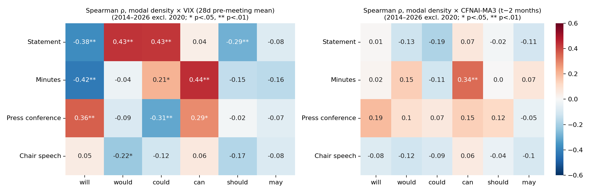

# Abstract

Modal auxiliaries are the grammatical resource with which a central bank calibrates commitment, prediction and possibility. Previous work has treated modality in central-bank text as an aggregate index of hedging or ambiguity and has related such indices to the business cycle. This paper examines instead the *constructions* in which six modals — *will, would, could, can, should, may* — occur in Federal Open Market Committee (FOMC) communication between January 2014 and April 2026 (101 post-meeting statements, 99 sets of minutes, 80 press-conference transcripts, 124 Chair speeches; 1.93 million tokens, 24,589 modal tokens), and asks how those constructions co-vary with the macroeconomic environment. Extraction is dependency-based and resolves copular *be* to its predicate complement, exposing an idiom family — *will/would/may be appropriate* — that functions as a graded commitment scale and whose internal modal choice tracks the policy stance. Within statements each modal is bound to essentially one following-verb construction; every change point in modal frequency coincides with the insertion or deletion of one formulaic sentence at a policy-framework event; and the set of modal constructions present at a meeting has a retention half-life of about seventeen meetings. Relating construction frequencies to real activity (CFNAI, real-time lag) and uncertainty (pre-meeting VIX) under a discovery-then-adversarial-verification protocol (exhaustive screens with false-discovery-rate control; every candidate re-estimated excluding 2020, with rank correlations and sub-period sign checks), we find that the robust macro correlate of FOMC modal use is *uncertainty, not activity* — the counter-cyclical modality documented for the Bank of Japan does not transfer to the Fed. The cyclical signal is carried not by aggregate modality, which masks opposite-signed constructions, but by three specific mechanisms: calm-era outlook formulas (*would/will expand*, *will … warrant only gradual increases*) that are withheld at high-VIX meetings even within their active lifespan; crisis-adopted conditional-commitment boilerplate (*would be prepared … could impede*) whose apparent stress-sensitivity is a one-time adoption event; and a live deliberation idiom in the minutes (*it would be appropriate to …*) whose density rises with uncertainty across every robustness cut. Lead–lag and Granger tests that survive artifact screening show modest text-leads-macro structure (minutes *could* leads CFNAI declines by ~6 months; statement *will* leads VIX), but no modal feature adds incremental predictive power over macro persistence after multiplicity control. Modal statistics in edited institutional genres are the trace of discrete drafting decisions; their macroeconomic content lives in when sentences are withheld or adopted, not in how much modality a document contains.

**Keywords:** modal verbs; modality; formulaic language; collostructional analysis; central bank communication; FOMC; uncertainty; VIX; change-point detection; corpus linguistics

# 1. Introduction

Since 16 September 2020 every post-meeting statement of the Federal Open Market Committee has contained the sentence *"The Committee would be prepared to adjust the stance of monetary policy as appropriate if risks emerge that could impede the attainment of the Committee's goals."* Before that date, *would* and *could* were virtually absent from the statement genre; after it, each accounts for roughly 15% of the six core modals in every statement. A frequency count of "hedging modals" would register this as a marked and durable increase in tentativeness in Federal Reserve communication — and, because the sentence arrived in a high-uncertainty year, a correlational study would register hedging as counter-cyclical. It is nothing of the kind. It is one sentence, adopted once, and carried forward at forty-six consecutive meetings.

This example motivates both halves of the present study. The first half asks what the modal-verb system of FOMC communication looks like when it is described at the level of the *construction* — the modal, the lexical verb it scopes over, the subject, the conditional frame, the embedding — rather than at the level of the pooled frequency count. The second half asks what such constructions have to do with the state of the economy: whether they track real activity or uncertainty, whether they merely react to macroeconomic conditions or contain information that leads them, and whether any of the apparent covariation survives the two hazards that beset this literature — the extreme pandemic observations of 2020, and the persistence induced by boilerplate.

Research on central-bank communication has increasingly turned to text as data (Blinder et al., 2008; Bholat et al., 2015; Hansen & McMahon, 2016), and modality has been proposed as a marker of the ambiguity or hedging with which a central bank conveys unfavourable information. The benchmark result is Kawamura, Kobashi, Shizume and Ueda (2019), who classify modal expressions in the Bank of Japan's Monthly Report and find them counter-cyclical: ambiguous modality rises when the leading index of activity falls, which they interpret as strategic obfuscation. On the linguistic side, Resche (2004, 2015) documents pervasive hedging in central bankers' speeches but argues that hedging is "diffuse" and cannot be captured by counting a closed list of devices. Both literatures pool the modals. What neither can see is the construction level: *which* verb follows *which* modal, in which genre, for how many meetings — and it is at that level, we will show, that the economically meaningful variation lives.

The linguistic literature on the English modals supplies the descriptive tools: the epistemic/deontic/dynamic semantics of the modal auxiliaries (Coates, 1983; Palmer, 1990, 2001), their register-specific diachrony (Leech, 2004; Bowie et al., 2013; Collins, 2009), collostructional analysis of the association between a construction and its lexical fillers (Stefanowitsch & Gries, 2003; Gries & Stefanowitsch, 2004), and the study of formulaic sequences and lexical bundles in institutional registers (Biber et al., 1999; Wray, 2002; Biber & Barbieri, 2007). The economics literature supplies the macro anchors: a real-activity index observable in real time (the Chicago Fed National Activity Index) and a market-priced uncertainty index (the VIX), the pairing that keeps our design comparable to Kawamura et al.'s leading-index-plus-volatility specification.

We ask five questions:

- **RQ1** With which verbs — after resolving copular *be* to its predicate complement — does each modal combine, and how sharply do the modals' collocational profiles differ?
- **RQ2** How have the frequencies of the six modals changed between 2014 and 2026, and are the changes gradual trends or discrete steps?
- **RQ3** How persistent are modal constructions in the statement genre — what is their "half-life" across meetings — and what triggers their appearance and disappearance?
- **RQ4** How do the four genres divide the functional labour among the modals?
- **RQ5** How do modal constructions co-vary with real activity and uncertainty; does any of the covariation lead the macroeconomy; and how much of it survives adversarial robustness checks?

Because RQ5 invites exactly the kind of correlational fishing that produces fragile results, we adopt a two-stage protocol: exhaustive screens over all modals, verb classes and constructions with Benjamini–Hochberg false-discovery-rate control, followed by adversarial verification of every surviving candidate — re-estimation excluding 2020, Spearman rank correlations alongside Pearson, sub-period sign checks, sparsity audits, era-dummy and pre-whitened regressions. About half of the screen's headline hits die in verification, and we report the casualties alongside the survivors.

The answer to RQ1–RQ4 is that FOMC statement language is *edited formulaicity*: each modal is bound to one or two following-verb constructions, 70–100% of modal tokens sit in sentences repeated across three or more meetings, every change point coincides with one sentence's insertion or deletion at a policy event, and the construction set has a retention half-life of about seventeen meetings. The answer to RQ5 has three parts. First, the robust macro correlate of FOMC modal use is *uncertainty, not activity*: the Kawamura-type counter-cyclical relation between modality and an activity index does not exist in this corpus, in any genre, with or without 2020. Second, the uncertainty signal is carried by identifiable constructions with three distinct mechanisms — calm-era outlook formulas withheld under stress, crisis-adopted boilerplate mistakable for stress response, and one live deliberation idiom (*it would be appropriate to …*) in the minutes — while aggregate modal counts mask these opposite-signed components. Third, the lead–lag structure that survives artifact screening is real but modest (minutes *could* leads activity declines by about six months; statement *will* leads the VIX), and no modal feature adds incremental predictive power over macro persistence once multiplicity is controlled.

The paper contributes (i) the first construction-level description of modal verbs in FOMC communication across four genres, with copular-*be* resolution that exposes the *be appropriate* commitment scale; (ii) a survival/retention operationalisation of the persistence of formulaic language, linked to institutional events by change-point detection; (iii) a macro-linguistic analysis run under an explicit discovery-then-verification protocol, with a documented artifact ledger; and (iv) evidence that in edited genres the economically informative unit is the sentence-level editing decision, not the pooled modality index — a caution with direct consequences for text-based measures of central-bank tone and uncertainty.

# 2. Background

## 2.1 The semantics of the English modals

The nine central modal auxiliaries of English express three broad families of meaning (Coates, 1983; Palmer, 1990, 2001): *epistemic* modality, concerning the likelihood of a proposition (*inflation may rise*); *deontic* modality, concerning obligation, permission and advisability (*the Committee should be patient*); and *dynamic* modality, concerning ability, volition and circumstantial possibility (*we can be patient*; *the Committee will continue to monitor*). *Will* additionally carries future-time reference and, with an agentive subject, volition or commitment; *would* is its past/hypothetical counterpart and the vehicle of back-shifting in reported speech and of conditional and tentative uses (*I would say*); *could* splits between ability and epistemic possibility. The reading a modal receives is determined largely by its co-text — subject, following verb, negation, conditional marking, embedding (Coates, 1983; Nuyts, 2001; Depraetere & Reed, 2006) — which is why an adequate description must start from the modal + predicate construction rather than from the modal alone. When the following verb is copular *be*, the meaning-bearing element is the complement: *would be prepared* (readiness), *may be appropriate* (evaluative judgement), *can be patient* (speaker stance). Analyses that stop at *be* miss precisely the constructions that matter in this genre — a point our extraction addresses directly (§3.2).

Diachronic corpus work shows that the modals are not stable in frequency: between 1961 and 1991/92 the core modals fell by 9.5% in written British and 12.2% in written American English, with *shall* (−44%), *must* (−29% to −34%) and *may* (−17% to −32%) declining steeply, *should* declining moderately (−12% to −14%), and *will, would, can* and *could* nearly stable (Leech, 2004, pp. 66–67; Mair & Leech, 2006; Leech et al., 2009). At the same time, a single publication or genre can move sharply against the community-wide trend: *may* rose by 54% in *TIME* magazine over the same decades in which it fell by roughly a third in the matched reference corpora — a divergence attributed to that magazine's editorial shift towards speculative reporting (Millar, 2009, as discussed in Bowie, Wallis & Aarts, 2013, pp. 59–60) — and modal use rises steeply in some spoken genres while most decline (Bowie et al., 2013). Our data allow a complementary test at meeting-level resolution inside one institution.

## 2.2 Hedging, modality and central-bank discourse

In applied linguistics, modals belong to the repertoire of *hedges* (Hyland, 1996, 1998), and central-bank and economic-forecast discourse is hedging-dense — the Federal Reserve Chair's press conferences alone run to roughly 758 hedges per 10,000 words (Deng, Ali & Zin, 2024). Resche (2015), analysing 103 central bankers' speeches from 2008–2013, counts 4.5–5.8% of running words as classical hedging devices but argues that hedging in this discourse is diffuse — justification, historical reference, metaphor — so that counting devices without co-text "would be a vain endeavour". We accept the critique and respond by measuring the construction and its persistence rather than the modal.

In economics, Kawamura et al. (2019) classify sentence-final modal expressions in the Bank of Japan's Monthly Report (1998–2015) by human coding and find that ambiguous modality is counter-cyclical — more frequent when the leading index is low, even controlling for the VIX — which they interpret, in a persuasion-game framework, as strategic obfuscation of unfavourable information. Two features of their study matter for ours: their main specification pairs an activity index with a volatility index, which we mirror; and their modality results are fragile to first-differencing (their §3.3.1), a warning about persistence-driven correlation that our verification protocol takes seriously. They close by asking whether their results hold for the Federal Reserve. Our answer, developed in §4.7, is that they do not: FOMC modality shows no counter-cyclical relation to activity; its robust correlate is uncertainty, and even that is carried by specific constructions rather than by modality in aggregate.

## 2.3 Formulaic language, lexical bundles and collostructions

Institutional writing is built from recurrent multi-word sequences — register-specific lexical bundles with discourse and stance functions (Biber et al., 1999; Biber & Barbieri, 2007), formulaic sequences stored and retrieved whole (Wray, 2002). FOMC statements are an extreme case: each statement is drafted as a revision of the previous one (Meade & Acosta, 2015), and departures from the previous statement's wording move markets (Ehrmann & Talmi, 2020). Collostructional analysis (Stefanowitsch & Gries, 2003; Gries & Stefanowitsch, 2004) quantifies the association between a construction slot and its lexical fillers with the Fisher–Yates exact test; its distinctive-collexeme variant contrasts the six modal frames directly.

## 2.4 Text analysis of central-bank communication

Methods for quantifying central-bank text range from dictionary tone (Loughran & McDonald, 2011) and automated scaling of statements (Lucca & Trebbi, 2009; Meade & Acosta, 2015) to topic models (Hansen & McMahon, 2016; Hansen et al., 2018), text-derived objective functions (Shapiro & Wilson, 2022), the temporal orientation of communication (Byrne et al., 2023) and vocal tone (Gorodnichenko et al., 2023). Forward guidance is the natural home of modal verbs, and the Odyssean/Delphic distinction (Campbell et al., 2012) maps onto the grammatical contrast between volitional *will* with the Committee as subject and predictive/epistemic modality with economic subjects.

## 2.5 Institutional background

The FOMC statement (340–840 tokens in our period) is drafted by staff from the previous statement and edited collectively; changes are deliberate and documented. Four events in our window changed standing modal-bearing sentences: lift-off (16 December 2015); the *Addendum to the Policy Normalization Principles and Plans* (14 June 2017); the revised *Statement on Longer-Run Goals and Monetary Policy Strategy* (27 August 2020; Powell, 2020), after which the September 2020 statement was rewritten; and the 2025 framework review (22 August 2025).

## 2.6 Does central-bank text lead the economy?

Because RQ5 asks whether modal constructions can serve as leading indicators, we summarise what the literature licenses. The strongest evidence concerns policy and expectations rather than realised activity: FOMC statement content leads the policy rate by up to a year and accounts for a substantial share of its forecast-error variance at 6–12 months, over and above market prices measured minutes after release (Lucca & Trebbi, 2009); the text of pre-meeting Fed documents predicts the Fed's own forecast errors one to two years ahead (Aruoba & Drechsel, 2024); and the polarity of the Bank of Japan's reports Granger-causes the government's leading index at a three-month lead (Kawamura et al., 2019). Evidence that *modality specifically* leads realised macro outcomes is, by contrast, thin: Kawamura et al.'s modality correlations vanish in first differences, and direct tests of communication against realised macro variables tend to be null (e.g., Gardner et al., 2022, fn. 24). Our design therefore treats "modal constructions as leading indicators" as a hypothesis to be tested against activity and uncertainty with explicit artifact controls, not as a premise — and our results (§4.8) land close to the literature: real but modest lead–lag structure, no incremental predictive power.

# 3. Data and methods

## 3.1 Corpus

The corpus comprises all FOMC post-meeting statements, minutes, press-conference transcripts and Chair speeches published on the Federal Reserve Board website from January 2010 to April 2026, collected as plain text with metadata. The analysis window is January 2014 to April 2026; 2010–2013 is used for genuine sample extension in robustness (§4.7). Four documents catalogued as statements but not post-meeting statements (an implementation statement of 11 Oct 2019, a facility announcement of 31 Mar 2020, and the 2020 and 2025 framework announcements) are excluded. Text was repaired for encoding artefacts and sentence-segmented with spaCy (Honnibal & Montani, 2017). Table 1 summarises the corpus.

**Table 1.** Corpus, 2014-01-01 to 2026-04-29.

| Genre | Documents | Tokens | Sentences | Six-modal tokens | per 1,000 tokens |
|---|---:|---:|---:|---:|---:|
| Statement | 101 | 47,351 | 1,816 | 780 | 16.5 |
| Minutes | 99 | 871,758 | 28,473 | 7,081 | 8.1 |
| Press conference | 80 | 697,340 | 35,277 | 13,221 | 19.0 |
| Chair speech | 124 | 313,299 | 13,870 | 3,507 | 11.2 |
| Total | 404 | 1,929,748 | 79,436 | 24,589 | 12.7 |

## 3.2 Extraction of modal constructions, with copular-be resolution

Every token tagged as a modal auxiliary (Penn MD), plus contracted *'ll*/*'d*, was extracted with attributes from the dependency parse: the normalised modal; the *lexical head verb* it scopes over, obtained by skipping auxiliary chains, so that passives and progressives resolve to the lexical verb (*could be affected* → *affect*; *will be moving* → *move*); negation; passive/perfect/progressive marking; the clause subject (head lemma and a nine-way type); conditional marking; embedding under reporting/mental verbs; and interrogativity.

When the resolved head is copular *be*, the analysis unit would otherwise bottom out in a semantically empty verb. We therefore resolve the *predicate complement*: adjectival (acomp/oprd: *would be **prepared***, *may be **appropriate***, *can be **patient***), nominal (attr: *would be a **drag***), prepositional (*will be in a **position** to*), or adverbial, together with any to-infinitive under the complement (*prepared **to adjust***). The analysis variable throughout is the **predicate**: the lexical verb, or *be+complement* for copular uses. Of 4,223 copular-*be* heads in the six-modal data, 91.9% resolve to a complement. The resolution matters: it surfaces the *be appropriate* idiom family — *would be appropriate* (303 tokens corpus-wide), *will be appropriate* (231), *may be appropriate* (79) — and *would be prepared* (157), all previously invisible inside "modal + *be*". In an author-coded random sample of 60 tokens, the lexical head was correctly identified in 56 (93%) and the heuristic meaning type agreed in 54 (90%); a 200-token sample with blank coding columns is distributed for independent double coding.

Following verbs are assigned to semantic classes following Biber et al. (1999, ch. 5) — activity, communication, mental, causative, occurrence, existence, aspectual — plus a domain policy-action class; copular predicates are classed by complement type (copular-adjectival/nominal/prepositional).

## 3.3 Construction analysis (RQ1)

For each modal and genre we tabulate all predicates and their within-modal shares and compute a distinctive-collexeme analysis (Fisher–Yates exact test; collostruction strength as signed −log₁₀ *p*) and the Jensen–Shannon divergence (base 2) between the predicate distributions of each modal pair.

## 3.4 Time series (RQ2)

Per document: raw count, density per 1,000 tokens, and share among the six modals. Trends: Mann–Kendall with Sen's slope. Structural breaks: PELT (Killick et al., 2012; Truong et al., 2020) on standardised series, minimum segment 4 meetings, penalty 2 ln *n*. Persistence: AR(1) autocorrelation and implied half-life.

## 3.5 Formulaicity, edit events and construction half-lives (RQ3)

Modal-bearing sentences are normalised and clustered across statements at similarity ≥ 0.85; clusters in ≥ 3 statements are *formulaic*. Edit events are clusters added/removed between consecutive statements. Persistence is quantified by (a) Kaplan–Meier survival of construction cohorts (maximal consecutive-meeting runs of a modal + predicate pair, right-censored), (b) *retention*: the share of constructions (or sentences) present at meeting *t* still present at *t+k*, averaged over *t*, with the half-life the *k* at which retention crosses 0.5, and (c) the AR(1) half-life of the frequency series.

## 3.6 Contexts and genre (RQ4)

Rates of negation, passive, conditional marking, embedding, questions and contraction, and subject- and meaning-type distributions, by modal and genre; χ² with standardised residuals; Chair and policy-phase contrasts within genre.

## 3.7 Macroeconomic data and alignment (RQ5)

Following the advisor-fixed specification, the **main tests pair one activity variable with one uncertainty variable**, keeping comparability with Kawamura et al.'s leading-index-plus-VIX design: the Chicago Fed National Activity Index, three-month moving average (CFNAI-MA3), and the CBOE VIX. Real-time alignment mirrors Kawamura et al.'s two-month lag for composite indexes: for a document dated in month *m* we use CFNAI-MA3 for month *m−2* (alternative lag *m−1* in robustness) and the mean of daily VIX over the 28 calendar days ending the day before the document date (inter-meeting window in robustness). The unemployment gap (UNRATE − NROU, one-month lag) and the core-PCE inflation gap (year-on-year core PCE − 2%, two-month lag) enter **robustness specifications only**. For lead–lag analysis we also record CFNAI-MA3 at *m+1, +3, +6* and the post-meeting 28-day VIX. All series are from FRED; the alignment table covers all 531 documents from 2010 with no missing values in the main variables.

## 3.8 Statistical protocol: discovery, then adversarial verification

RQ5 is answered in two stages. **Discovery**: exhaustive screens — every modal × genre × metric (E1), every modal × verb-class cell with ≥ 40 tokens (E4), every modal + predicate construction above a genre-specific frequency floor (E5) — against CFNAI-MA3 and VIX, with Pearson and Spearman coefficients and Benjamini–Hochberg (1995) *q*-values within each screen; Newey–West (1987) HAC regressions (4 lags) of densities on CFNAI + VIX, with gap-augmented and alternative-lag specifications (E2); cross-correlation functions at monthly shifts *k* = −9…+9, Granger (1969) causality tests in both directions on ADF-checked (differenced where needed) series, and incremental predictive regressions of CFNAI-MA3(*m+3*) and the post-meeting VIX change on each text feature over macro controls (F1–F3).

**Adversarial verification**: every candidate finding was independently re-estimated with instructions to refute it: (i) recomputation of the core statistic; (ii) exclusion of calendar-2020 (the pandemic generates CFNAI ≈ −7.6 and pre-meeting VIX ≈ 50, extreme leverage points); (iii) Spearman alongside Pearson; (iv) a sparsity audit (share of zero-count meetings; series with a handful of tokens are disqualified from time-series claims); (v) sign consistency across the 2014–2019 and 2021–2026 halves. A finding is **confirmed** only if it survives (ii)–(iv) with the same sign and *p* < .10. The headline cell received three further checks: an era-dummy (post-2021) HAC regression, AR(1) pre-whitening of both series, and a circular-shift permutation test that preserves autocorrelation. Robustness additionally includes a genuine 2010–2026 sample extension rebuilt from the token level. We report the artifact ledger (§4.7.4) alongside the survivors; roughly half of the screens' headline hits die in verification, which we regard as the protocol working as intended.

# 4. Results

## 4.1 Overview

Figure 1 shows the density of the six modals by year and genre. Density levels are genre-specific (press conferences 19.0 and statements 16.5 per 1,000 tokens; minutes 8.1); the dominant modal differs by genre (*will* in statements at 78% of six-modal tokens, *would* in minutes at 50%); and the only genre with dramatic within-window redistribution is the statement, where *should* disappears in 2017 and *would* and *could* appear in 2020.

## 4.2 RQ1: Predicates and collostructional profiles

Table 2 lists, for the pooled corpus, the most frequent predicates of each modal (copular *be* resolved to its complement) and the most attracted and repelled collexemes.

**Table 2.** Predicates of the six modals, all genres pooled, 2014–2026. Collostruction strength = signed −log₁₀ *p* (Fisher exact); ratio = observed/expected.

| Modal (n) | Most frequent predicates | Most attracted collexemes (ratio, strength) | Most repelled |
|---|---|---|---|
| will (7,558) | continue 608; take 445; have 269; **be appropriate 231**; see 186; do 177; assess 171 | continue (2.0, 90.3); take (1.8, 48.7); assess (2.4, 40.9); monitor (2.5, 26.3); watch (3.0, 22.8) | say (−31.4); be prepared (−18.6); expect (−18.5) |
| would (8,172) | say 694; **be appropriate 303**; continue 278; like 235; take 214; expect 164; **be prepared 157** | say (2.2, 145.5); like (3.0, 111.2); **be prepared (2.9, 67.5)**; expect (2.3, 36.8); want (2.5, 33.9) | do (−26.7); see (−24.8); impede (−17.9) |
| could (3,307) | impede 162; lead 92; have 91; affect 81; follow 81; help 78 | impede (6.9, 124.3); follow (4.6, 37.7); lead (4.2, 37.4); pose (5.2, 24.5) | say (−38.7); continue (−29.1); take (−17.3) |
| can (2,651) | do 200; see 115; say 91; give 68; tell 60 | do (3.6, 62.8); tell (4.3, 24.1); give (3.8, 23.0); see (2.4, 18.4) | continue (−23.6); remain (−8.1); take (−7.2) |
| should (1,351) | help 93; continue 40; take 33; do 29 | help (4.2, 31.9); interpret (13.0, 19.0); affirm (18.2, 17.7); note (8.1, 10.8) | say (−15.7); depend; warrant |
| may (1,550) | **be appropriate 79**; warrant 64; have 39; need 34; contribute 33 | warrant (4.9, 26.7); authorize (14.6, 25.3); contribute (6.8, 19.1) | continue (−15.0); do (−4.9); look (−4.1) |

The functional profiles of v1 are preserved — *will* attracts the Committee's procedural verbs, *would* the tentative speech acts, *could* adverse causation, *can* ability and action, *should* *help* and press-conference cognitives, *may* the forward-guidance idiom *may warrant* — but the copular resolution adds a layer. The complement inventory (Table 3) shows that the modal-*be* space is dominated by a single evaluative idiom, ***be appropriate*** (613 tokens across *will/would/may*, plus 22 *could*), alongside *be prepared* (157, almost exclusively with *would*), *be able* (112, spread across modals), and — uniquely for *can* — speaker-stance adjectives (*patient* 16, *sure* 7, *confident* 4: *we can be patient*, *I can't be sure*).

**Table 3.** Top copular complements per modal (all genres; A7).

| Modal | Top *be + X* complements (n) |
|---|---|
| will | appropriate (231), able (47), happy (22), percent (18), dependent (12), consistent (11), patient (11) |
| would | appropriate (303), prepared (157), consistent (67), important (58), helpful (25), useful (20) |
| could | appropriate (22), helpful (13), persistent (10) |
| can | patient (16), sure (7), difficult (7), effective (7), confident (4) |
| may | appropriate (79), lower (17), able (11) |

The *be appropriate* family functions as a graded commitment scale — *it **will** be appropriate to maintain* (committed), *it **would** be appropriate to raise* (deliberative), *additional firming **may** be appropriate* (tentative) — and the modal chosen *within* the idiom tracks the policy situation: in the minutes and press conferences, *will be appropriate* dominates the 2013–2015 forward-guidance years (21–24 tokens/year) and the 2021–2022 tightening run-up; 2018 is *would*-only (23 *would* vs 0 *will*: normalization-era hypotheticals); and *may be appropriate* spikes exactly twice, in 2019 (11) and above all in 2023 (43), the "additional policy firming may be appropriate" episode after SVB. A modality index that pooled these tokens would erase precisely this scale.

In statements the concentration found in v1 sharpens further under predicate resolution. Of 612 statement tokens of *will*: *continue* 125, *take* 123, *assess* 72, *be appropriate* 47, *expand* 34, *monitor* 32, *depend* 28, *warrant* 21. All 49 tokens of *would* are *be prepared* (46) or near-variants; all 50 of *could* are *impede* (46) or *pose* (4); *can* occurs four times (*be patient*, *be found*); *should* is *help* 21, *maintain* 6, *promote* 6; *may* is *warrant* 15 and *be appropriate* 10. The Jensen–Shannon divergence between the predicate distributions of any two modals in statements is 0.76–1.00 (pooled corpus: 0.26–0.55): in the statement genre each modal is, to a first approximation, one construction.

## 4.3 RQ2: Trends and change points

The v1 findings survive re-extraction unchanged and are summarised briefly. In statements (Mann–Kendall over 101 meetings): *would* and *could* increase strongly in density and share (τ ≈ 0.56–0.57, *p* < .0001, from zero to ~2.8 per 1,000 and 15.5% share); *should* falls to zero (τ = −0.43); *may* declines weakly; *can* is absent; and — resolving the first of the motivating puzzles — the **share** of *will* falls (τ = −0.32) while its **density does not** (τ = −0.09, *p* = .21; 12.7 → 12.4 per 1,000): the "decline of *will*" is a compositional effect of the arrival of *would/could* and the halving of statement length (839 → 340 tokens). The changes are steps, not slopes: PELT places the *should* break at 14 June 2017 (share .130 → .000; the meeting of the normalization addendum, where the reinvestment sentence *"…should help maintain accommodative financial conditions"* was deleted after 21 statements), and the *would* and *could* breaks at 16 September 2020 (.00 → .15; the first meeting after the revised framework, which introduced the conditional-commitment sentence). *Will* breaks at lift-off (2015-12-16, .72 → .94, with three new *will*-guidance sentences) and at 2020-09-16 (compositional). *May* has short-lived guidance episodes (2014–15 *may … warrant*; 2019 *may be appropriate*; 2023 *additional policy firming may be appropriate*). AR(1) share half-lives: *could* 23, *would* 10, *should* 7, *will* 4, *may* 1.7, *can* 0.8 meetings.

Across the other genres, *should* declines everywhere (consistent with the community-wide decline; Leech, 2004), the *would/could* rise is confined to statements, and the only rising modal in press conferences is *can* (τ = +0.21) — genre-specific editorial and speaker effects, not language change.

## 4.4 RQ3: Formulaicity and half-lives

Between 68% and 100% of statement tokens of each modal in any year sit in sentence clusters recurring in ≥ 3 statements; for *would* and *could* after 2020 the figure is 100% — every token comes from the single conditional-commitment sentence. Edit events concentrate in regime transitions (2014: 20 added/23 removed; 2020: 31/26) and vanish in stable years (2016: 0/1). Cohort survival of (modal, predicate) constructions is bimodal — 40% one-off, survivors lasting up to 51 meetings — so the Kaplan–Meier median is 3 meetings while the *retention* measure is the informative one: the construction set present at a meeting retains 89% of its members one meeting later and crosses half-retention at **16.6 meetings** (*will* 18.1; *should* 6.1; *may* 4.0; *can* 1.0; *would/could* still ≥ 0.91 at 24 meetings, i.e. no measurable half-life since adoption). Modal-bearing sentences have a half-life of 6.4 meetings.

## 4.5 RQ4: Genre division of labour

The association between genre and modal is strong (χ² = 4,638, df = 15, Cramér's V = 0.251): statements over-use *will* (+24.0 standardised residual), minutes *would* (+24.8) and *could* (+22.9), press conferences *can* (+15.0), speeches *may* (+14.7). The context features explain the residuals: 64–70% of minutes *would/should* tokens are embedded under reporting verbs (back-shifted *will* of the participants' speech); press-conference *can* is negated in 15% of cases and second-person in a third (*you can see*; *we can't do everything*); statement *would/could* co-occur with a conditional marker in 92–94% of cases (the single *if*-sentence). Within statements the Yellen–Powell contrast (V = 0.38) is entirely located at September 2020; in press conferences, where personal style should show, it is small (V = 0.09).

## 4.6 RQ5a: Modal use and the macroeconomic environment

We now relate construction frequencies to the macro environment under the protocol of §3.8. Figure 6 shows the robust summary: Spearman correlations of modal densities with pre-meeting VIX and lagged CFNAI-MA3, computed excluding 2020.

**Uncertainty, not activity.** Of the twelve cells that pass BH *q* < .05 in the full-sample screen (E1), eleven involve the VIX; the sole CFNAI cell (speech *can*) is a 2020 artifact (Spearman ρ = −.04; sign flips excluding 2020). Aggregate six-modal density is uncorrelated with CFNAI in all four genres, full sample and excluding 2020; where an activity link survives at all it is mildly *pro*-cyclical (press-conference density excluding 2020: r = +.36). **The counter-cyclical modality that Kawamura et al. (2019) document for the Bank of Japan — more modal hedging when activity is weak — does not exist in FOMC communication.** The verified VIX evidence concentrates in two genres: the minutes and the press conference. (The statement and speech *can* × VIX cells are themselves 2020-driven and are excluded from the claim; see the ledger, §4.7.4.)

**The headline cell: minutes *can* × VIX.** The density of *can* in the minutes correlates with pre-meeting VIX at r = +.443/ρ = +.464 (n = 99); excluding 2020, r = +.445/ρ = +.443; the HAC coefficient on VIX (+.0094, *p* = .0002) survives the gap-augmented and alternative-lag specifications, exclusion of 2020 (+.0106, *p* = .0014), and a post-2021 era dummy (*p* = .005, dummy itself n.s.); the binary any-*can* indicator alone yields ρ = +.43, and the median pre-meeting VIX is 18.9 for minutes containing *can* against 14.4 for those without (Mann–Whitney *p* = 2.6 × 10⁻⁵). The relation extends to the genuine 2010–2026 rebuild (excluding 2020: r = .30/ρ = .32). Three honest qualifications: the series is thin (84 tokens; 57% of meetings zero); the association is significant only in the 2021–2026 half (2014–19 ρ = +.23, n.s.), so part of the pooled correlation is a cross-era level shift; and it does not survive AR(1) pre-whitening (residual r = .04), while passing a circular-shift permutation test (*p* = .024) — i.e., this is a **low-frequency, regime-level co-movement**, not meeting-to-meeting covariation. Under high uncertainty the minutes talk more about what monetary policy *can* and *cannot* achieve — capability talk — but at the frequency of episodes, not of individual meetings.

**Construction level: three mechanisms.** The exhaustive construction screen (E5), after verification, resolves into three distinct mechanisms rather than a single "hedging rises with stress" gradient:

1. **Calm-weather outlook formulas, withheld under stress.** The growth-outlook constructions — minutes *would expand* (*"economic activity would expand at a moderate pace"*), statement *will expand*, *will … warrant only gradual increases*, *will evolve* — correlate negatively with VIX at ρ = −.39 to −.48, full sample and excluding 2020, and are uncertainty-specific (CFNAI ρ = .03–.13, n.s.). Crucially this is not merely the lifecycle of a dead sentence: **within its own active window (2014–2018, 12% zero meetings), minutes *would expand* still tracks VIX at ρ = −.40 (*p* = .010)** — the sentence was withheld at high-VIX meetings even while it was current, an editing decision meeting by meeting. The relation extends to 2010–2026 (ρ = −.42).

2. **Crisis-adopted boilerplate, mistakable for stress response.** The apparent "foul-weather" constructions — *could impede*, *would be prepared* — owe their positive VIX correlations entirely to the one-time adoption event of September 2020: before 2020 the sentence frame appeared roughly once a year; after adoption it is literally constant (*be prepared* exactly twice in every one of the 43 minutes from 2021 through 2026). Their VIX correlation is an era-composition effect, not stress sensitivity — precisely the confound the introduction's example warned against.

3. **A live deliberation idiom.** Minutes ***would be appropriate*** (n = 247; zero at only 7% of meetings; *"…it would be appropriate to [adjust/raise/maintain/reduce]…"*) is the genuine exception: its density rises with VIX in every cut — full ρ = +.35, excluding 2020 ρ = +.31 (r = +.42), positive within the 2021–2026 half alone, mildly positive with CFNAI (ρ ≈ +.23), and present across the entire 2010–2026 sample (extension ρ = +.17–.22). It peaks at active-policy-change meetings: policy *deliberation intensity*, grammatically encoded as hypothetical evaluation, rises with uncertainty. The whole *be appropriate* family in the minutes behaves the same way (excluding 2020: ρ = +.28, *q* = .004), and, at the class level, statement copular-adjectival predicates rise with VIX (excluding 2020: ρ = +.39) — under uncertainty, the Fed's predicates shift from events to evaluations.

**Aggregation masks the signal.** Minutes *would* in aggregate is uncorrelated with VIX (ρ = +.10) while its constructions span ρ = −.48 (*would expand*) to +.38 (*would be prepared*); conversely minutes *will* is significant while *will continue* inside it runs the opposite way. Masking runs in both directions: a modality index built at the modal level is not merely noisy but structurally uninformative about its own components. At the verb-class level the surviving pattern is coherent: under high VIX, *will* + mental verbs (*assess, monitor*) fall (statements ρ = −.45, minutes ρ = −.51, excluding 2020) while *will* + aspectual *continue* rises (ρ = +.39) — uncertain-times statements emphasise continuation of current policy over assessment schedules. A suggestive statement-level result completes the picture: excluding 2020, statement *will* density itself is negatively related to VIX (ρ = −.38; 2010–2026 extension ρ = −.42; HAC *p* = .007) — high-uncertainty statements carry fewer unconditional commitments — though this was not BH-significant in the pre-registered full-sample screen and the apparent compensating rise of *would/could* is an era-composition (Simpson's paradox) effect that we explicitly do not report as substitution.

**Robustness.** All results above survive the gap-augmented HAC specification (unemployment gap, core-PCE gap) with unchanged signs; none of the significant CFNAI coefficients of the main-spec HAC regressions survives exclusion of 2020 (seven of seven die, five flip sign), which is why no activity claim is made anywhere in this paper.

## 4.7 RQ5b: Lead–lag structure, predictive content, and the artifact ledger

### 4.7.1 What leads what

Cross-correlation functions relate each text feature at meeting *t* to the macro series shifted *k* months (*k* > 0: text leads), estimated excluding 2020 on series that pass the sparsity audit. The surviving structure (G3; Pearson and Spearman jointly significant):

**Table 4.** Lead–lag peaks, 2014–2026 excluding 2020.

| Feature | Target | Peak | Coefficients | Reading |
|---|---|---|---|---|
| Minutes *could* density | CFNAI-MA3 | *k* = +6 | r = −.45, ρ = −.32 | more *could* → activity weakens ~6 months later |
| Statement *will* density | VIX | *k* = +4 | r = −.42, ρ = −.48 | fewer *will* → VIX rises ~4 months later |
| Statement *will* density | CFNAI-MA3 | *k* = +3 | r = +.29, ρ = +.25 | weak positive lead |
| Press-conf. *can* density | VIX | *k* = +7 | r = +.45, ρ = +.41 | capability talk leads uncertainty (interpretation open) |
| Minutes *would be appropriate* | VIX | *k* = 0 | r = +.42, ρ = +.31 | contemporaneous deliberation signal |
| Minutes *will assess* | VIX | *k* = −7 | r = −.60, ρ = −.49 | macro leads text: reactive scheduling language |

Granger tests on the same cleaned series give a consistent picture: text→macro survives FDR for press-conference *can* → VIX (*q* = .040), minutes *could* → CFNAI (*q* = .040), press-conference *would* → VIX (*q* = .040), with statement *will* → VIX and press-conference *will* → VIX at *q* = .066; the reverse directions are uniformly non-significant on these series. The direction is not one-way overall — the largest single cross-correlation in the corpus is macro→text (*will assess*) — but where unidirectional structure survives, it runs from text to macro.

### 4.7.2 No incremental predictive power

Against the leading-indicator hypothesis in its strong form, the incremental predictive regressions are unambiguous: across 113 feature–target combinations, predicting CFNAI-MA3 three months ahead or the post-meeting VIX change over and above lagged CFNAI and pre-meeting VIX, **no text feature passes BH *q* < .10** (minimum *q* = .46). The honest summary, aligned with the literature (§2.6): modal constructions are significant *state variables* of the uncertainty environment with modest in-sample lead–lag structure, but incremental forecasting power beyond macro persistence is not established at this sample size. Event-window descriptives (F4) are consistent — the 2019 *may be appropriate* episode preceded the mid-cycle cuts, the 2023 episode preceded the last hike — but we present these as narrative, not inference.

### 4.7.3 Editing intensity is regime-driven, not uncertainty-driven

Two natural conjectures fail verification, and we report them as null results. The count of modal-bearing sentences added/removed between consecutive statements correlates with VIX at r = +.37 in the full sample — and at r = −.04 (ρ = .11) excluding 2020: editing intensity tracks *policy regime transitions* (2014 taper, 2020 framework), not uncertainty per se. Likewise the density of modal tokens in *novel* (non-formulaic) statement sentences shows no robust macro relation (full r = +.20, *p* = .048; excluding 2020, r = −.06). The cyclical information in this genre lives in *which standing sentences are present*, not in how much is being rewritten.

### 4.7.4 The artifact ledger

For transparency, the headline candidates killed in adversarial verification — all Pearson-significant in the full sample, none surviving the excl-2020/Spearman/sparsity battery: statement *can* × VIX (4 tokens, two in the March-2020 emergency statements); speech *can* × CFNAI and × VIX (sign flips); all seven significant CFNAI coefficients of the main HAC specification; press-conference *can do* × VIX (21% of tokens in 2020); minutes negated-*can* as a CFNAI leading indicator (2 tokens, one a memorial sentence); statement *can* → CFNAI Granger (*p* = .0000 → .456 excluding 2020); press-conference *will* × CFNAI at *k* = +1 (r = −.41 full → +.32 excluding 2020); novel-sentence modality × VIX; edit intensity × VIX. We also record a design correction: an earlier "2010–2026" robustness block was vacuous (the derived document series began in 2014); the extension reported here (G6) was rebuilt from the token level and is genuine.

# 5. Discussion

## 5.1 The five questions

The four linguistic puzzles of v1 retain their answers — *should* died with one reinvestment sentence at the 2017 normalization addendum; *will*'s density never fell; *would/could* are one framework sentence; *can* is structurally excluded from a third-person commitment genre — and the be-resolution adds a fifth: the modal-*be* space is one evaluative idiom, *be appropriate*, whose internal modal choice (*will/would/may*) is itself a commitment dial that the Committee turns with the policy situation (2013–15 *will*; 2018 *would*; 2019 and 2023 *may*).

The macro question resolves into a characterisation we did not anticipate when the analysis began. FOMC modality is not counter-cyclical hedging. Its robust macro correlate is uncertainty, and the relation is carried by three separable mechanisms: outlook formulas *withheld* when uncertainty is high (a meeting-level editing decision, demonstrably operative within a formula's active lifespan); crisis-*adopted* boilerplate whose apparent stress-sensitivity is an era artifact; and one live idiom of deliberation intensity, *it would be appropriate to …*, that rises with uncertainty across every cut. Aggregate modality masks all three.

## 5.2 Why the Bank of Japan result does not transfer

Kawamura et al. (2019) found modality rising in bad times and interpreted it as strategic ambiguity under unfavourable private information. In FOMC text, modality tracks the uncertainty environment, not the activity cycle — and even that association is low-frequency (it does not survive pre-whitening) and construction-specific. Three non-exclusive explanations: institutional (the FOMC statement is a committee-negotiated, heavily formulaic genre where modality is locked into standing sentences; the BoJ Monthly Report was a staff-drafted assessment text with room for sentence-final modulation); linguistic (Japanese sentence-final modality is a graded, productive system, and Kawamura et al. themselves show their result weakens in the English translation); and analytical (their modality correlations die in first differences — the same persistence hazard our protocol addresses — so the two studies may both be measuring regime-level co-movement, which in the Fed's case aligns with uncertainty rather than activity). What survives in both corpora is the association between *possibility-of-adverse-outcome* language and bad states: their negative-plus-modal topic is our *could impede* / *risks* conditional — with the difference that the Fed conventionalised it into a permanent sentence in 2020, converting a signal into a formula.

## 5.3 Modality as a state variable, not a forecaster

The evidence that central-bank text leads outcomes is strongest for policy and expectations (Lucca & Trebbi, 2009; Aruoba & Drechsel, 2024), and thin for realised macro aggregates. Our results sit exactly there: the surviving text-leads-macro structure (minutes *could* → activity at ~6 months; statement *will* → VIX at ~4) is consistent with the Fed's information advantage flowing into drafting choices — fewer unconditional commitments and more possibility talk when the internal outlook darkens, before the darkening is visible in CFNAI or the VIX — but no feature beats macro persistence out of sample-style, and the deliberation idiom is contemporaneous. For market analysis, the operational conclusion is that modal constructions are *state variables*: *would be appropriate* density reads deliberation intensity, the presence/absence of the outlook formulas reads the Committee's confidence in its own forecast, and the modal chosen inside *be appropriate* reads the commitment level — each interpretable meeting by meeting precisely because each is anchored to an identifiable sentence.

## 5.4 Implications for text-based indices

Three practical rules follow for hawkish/dovish, uncertainty and hedging indices built on FOMC text. First, remove or model standing sentences: one adopted sentence moved *would/could* from 0% to 15% of modal tokens permanently, and one deleted sentence removed *should* entirely; an index blind to boilerplate will date "regime changes in tone" to editing events. Second, do not aggregate modals: the informative components are opposite-signed within a single modal (*would expand* vs *would be appropriate*), so pooling cancels signal. Third, verify against 2020 leverage: in our screens roughly half of the full-sample Pearson "hits", including every activity-index result, were pandemic artifacts — an audit we suspect generalises to published text-based indices whose samples span 2020.

## 5.5 Limitations

Parser accuracy (93% head identification; 90% meaning-type agreement) is estimated on author-coded samples; independent double coding is provided for but not yet performed. The verb semantic classes are domain-adapted by fiat. The statement series has 101 observations and the minutes 99; meeting-level observations are autocorrelated (the boilerplate half-life *is* the phenomenon), so nominal *p*-values overstate independence — our claims rest on the cross-cut pattern (excl-2020, rank, sub-period, extension) rather than any single test, and the pre-whitening result for the headline cell shows how much of the covariation is low-frequency. The uncertainty interpretation rests on the VIX; discriminating financial-market volatility from policy or macro uncertainty (e.g., EPU-type indices) is a natural extension. Endogeneity is inherent: the Fed both observes and shapes the economy (Romer & Romer, 2000), so lead–lag structure licenses "contains information about", never "causes". Finally, the market-reaction step — whether the *sentence-level edit events* identified here move asset prices on announcement, in the spirit of Ehrmann & Talmi (2020) — is the designed next study, for which this paper supplies the treatment variable.

# 6. Conclusion

At construction level, the modal grammar of FOMC communication is small, formulaic and edited: each modal in the statement genre is one or two constructions; the *be appropriate* idiom spans three modals as a commitment scale; constructions persist with a half-life of about seventeen meetings and change by discrete insertion and deletion at policy events. Related to the macroeconomy under an adversarial verification protocol, this grammar turns out to encode the uncertainty environment, not the activity cycle: calm-era outlook formulas are withheld at high-VIX meetings even within their lifespan, deliberation idioms intensify with uncertainty, aggregate modality masks both, and the Bank-of-Japan-style counter-cyclical hedging result does not transfer to the Fed. Modal constructions are informative state variables of monetary-policy communication — and the information is carried by editing decisions about individual sentences, which is where analysts, and text-based indices, should look.

# References

Aruoba, S. B., & Drechsel, T. (2024). *Identifying monetary policy shocks: A natural language approach* (NBER Working Paper 32417).

Benjamini, Y., & Hochberg, Y. (1995). Controlling the false discovery rate: A practical and powerful approach to multiple testing. *Journal of the Royal Statistical Society B, 57*(1), 289–300.

Bowie, J., Wallis, S., & Aarts, B. (2013). Contemporary change in modal usage in spoken British English: Mapping the impact of "genre". In J. I. Marín-Arrese, M. Carretero, J. Arús Hita, & J. van der Auwera (Eds.), *English modality: Core, periphery and evidentiality* (pp. 57–94). De Gruyter Mouton.

Bholat, D., Hansen, S., Santos, P., & Schonhardt-Bailey, C. (2015). *Text mining for central banks* (CCBS Handbook No. 33). Bank of England.

Biber, D., & Barbieri, F. (2007). Lexical bundles in university spoken and written registers. *English for Specific Purposes, 26*(3), 263–286.

Biber, D., Johansson, S., Leech, G., Conrad, S., & Finegan, E. (1999). *Longman grammar of spoken and written English*. Longman.

Blinder, A. S., Ehrmann, M., Fratzscher, M., De Haan, J., & Jansen, D.-J. (2008). Central bank communication and monetary policy: A survey of theory and evidence. *Journal of Economic Literature, 46*(4), 910–945.

Byrne, D., Goodhead, R., McMahon, M., & Parle, C. (2023). *The central bank crystal ball: Temporal information in monetary policy communication* (CEPR Discussion Paper 17930).

Campbell, J. R., Evans, C. L., Fisher, J. D. M., & Justiniano, A. (2012). Macroeconomic effects of Federal Reserve forward guidance. *Brookings Papers on Economic Activity*, Spring, 1–80.

Coates, J. (1983). *The semantics of the modal auxiliaries*. Croom Helm.

Collins, P. (2009). *Modals and quasi-modals in English*. Rodopi.

Deng, Z., Ali, A. M., & Zin, Z. B. M. (2024). Features of hedging strategies performed by the Federal Reserve Chair in press conferences. *Theory and Practice in Language Studies, 14*(11), 3483–3495.

Depraetere, I., & Reed, S. (2006). Mood and modality in English. In B. Aarts & A. McMahon (Eds.), *The handbook of English linguistics* (pp. 269–290). Blackwell.

Ehrmann, M., & Talmi, J. (2020). Starting from a blank page? Semantic similarity in central bank communication and market volatility. *Journal of Monetary Economics, 111*, 48–62.

Federal Open Market Committee. (2017). *Addendum to the Policy Normalization Principles and Plans* (June 14, 2017).

Federal Open Market Committee. (2020). *Statement on Longer-Run Goals and Monetary Policy Strategy* (as amended effective August 27, 2020).

Gardner, B., Scotti, C., & Vega, C. (2022). Words speak as loudly as actions: Central bank communication and the response of equity prices to macroeconomic announcements. *Journal of Econometrics, 231*(2), 387–409.

Gorodnichenko, Y., Pham, T., & Talavera, O. (2023). The voice of monetary policy. *American Economic Review, 113*(2), 548–584.

Granger, C. W. J. (1969). Investigating causal relations by econometric models and cross-spectral methods. *Econometrica, 37*(3), 424–438.

Gries, S. Th., & Stefanowitsch, A. (2004). Extending collostructional analysis: A corpus-based perspective on "alternations". *International Journal of Corpus Linguistics, 9*(1), 97–129.

Hansen, S., & McMahon, M. (2016). Shocking language: Understanding the macroeconomic effects of central bank communication. *Journal of International Economics, 99*, S114–S133.

Hansen, S., McMahon, M., & Prat, A. (2018). Transparency and deliberation within the FOMC: A computational linguistics approach. *Quarterly Journal of Economics, 133*(2), 801–870.

Honnibal, M., & Montani, I. (2017). *spaCy 2: Natural language understanding with Bloom embeddings, convolutional neural networks and incremental parsing*.

Hyland, K. (1996). Writing without conviction? Hedging in scientific research articles. *Applied Linguistics, 17*(4), 433–454.

Hyland, K. (1998). *Hedging in scientific research articles*. John Benjamins.

Kaplan, E. L., & Meier, P. (1958). Nonparametric estimation from incomplete observations. *Journal of the American Statistical Association, 53*(282), 457–481.

Kawamura, K., Kobashi, Y., Shizume, M., & Ueda, K. (2019). Strategic central bank communication: Discourse analysis of the Bank of Japan's Monthly Report. *Journal of Economic Dynamics and Control, 100*, 230–250.

Killick, R., Fearnhead, P., & Eckley, I. A. (2012). Optimal detection of changepoints with a linear computational cost. *Journal of the American Statistical Association, 107*(500), 1590–1598.

Leech, G. (2004). Recent grammatical change in English: Data, description, theory. In K. Aijmer & B. Altenberg (Eds.), *Advances in corpus linguistics: Papers from ICAME 23* (pp. 61–81). Rodopi.

Leech, G., Hundt, M., Mair, C., & Smith, N. (2009). *Change in contemporary English: A grammatical study*. Cambridge University Press.

Loughran, T., & McDonald, B. (2011). When is a liability not a liability? Textual analysis, dictionaries, and 10-Ks. *Journal of Finance, 66*(1), 35–65.

Lucca, D. O., & Trebbi, F. (2009). *Measuring central bank communication: An automated approach with application to FOMC statements* (NBER Working Paper 15367).

Mann, H. B. (1945). Nonparametric tests against trend. *Econometrica, 13*(3), 245–259.

Mair, C., & Leech, G. (2006). Current changes in English syntax. In B. Aarts & A. McMahon (Eds.), *The handbook of English linguistics* (pp. 318–342). Blackwell.

Meade, E. E., & Acosta, M. (2015). *Hanging on every word: Semantic analysis of the FOMC's postmeeting statement* (FEDS Notes, September 30). Board of Governors of the Federal Reserve System.

Millar, N. (2009). Modal verbs in TIME: Frequency changes 1923–2006. *International Journal of Corpus Linguistics, 14*(2), 191–220.

Newey, W. K., & West, K. D. (1987). A simple, positive semi-definite, heteroskedasticity and autocorrelation consistent covariance matrix. *Econometrica, 55*(3), 703–708.

Nuyts, J. (2001). Subjectivity as an evidential dimension in epistemic modal expressions. *Journal of Pragmatics, 33*(3), 383–400.

Palmer, F. R. (1990). *Modality and the English modals* (2nd ed.). Longman.

Palmer, F. R. (2001). *Mood and modality* (2nd ed.). Cambridge University Press.

Powell, J. H. (2020). *New economic challenges and the Fed's monetary policy review*. Speech at the Jackson Hole Economic Policy Symposium, August 27.

Resche, C. (2004). Investigating "Greenspanese": From hedging to "fuzzy transparency". *Discourse & Society, 15*(6), 723–744.

Resche, C. (2015). Hedging in the discourse of central banks. *Studies in Communication Sciences, 15*(1), 83–92.

Romer, C. D., & Romer, D. H. (2000). Federal Reserve information and the behavior of interest rates. *American Economic Review, 90*(3), 429–457.

Sen, P. K. (1968). Estimates of the regression coefficient based on Kendall's tau. *Journal of the American Statistical Association, 63*(324), 1379–1389.

Shapiro, A. H., & Wilson, D. J. (2022). Taking the Fed at its word: A new approach to estimating central bank objectives using text analysis. *Review of Economic Studies, 89*(5), 2768–2805.

Stefanowitsch, A., & Gries, S. Th. (2003). Collostructions: Investigating the interaction of words and constructions. *International Journal of Corpus Linguistics, 8*(2), 209–243.

Truong, C., Oudre, L., & Vayatis, N. (2020). Selective review of offline change point detection methods. *Signal Processing, 167*, 107299.

Wray, A. (2002). *Formulaic language and the lexicon*. Cambridge University Press.

# Appendix A. Modal-bearing boilerplate sentences in FOMC statements

As in v1 (Appendix A there); full list in `results/tables/C2_boilerplate_modal_sentences.csv`.

# Appendix B. Macro-linguistic tables

E1–E6 (screens and robustness), F1–F4 (lead–lag, Granger, predictive, event windows), G1–G6 (verification battery: be-complement × macro, class triage, excl-2020 CCF/Granger, novel/formulaic verdicts, headline-cell checks, 2010–2026 extension), and the verified-findings ledger (`results/v2_verified_findings.json`) are distributed with the replication package.

# Appendix C. Supplementary materials

All derived tables, figures, extraction and analysis code (`experiments/00–09`), the macro alignment table, and the 200-token validation sample are available in the project repository.
