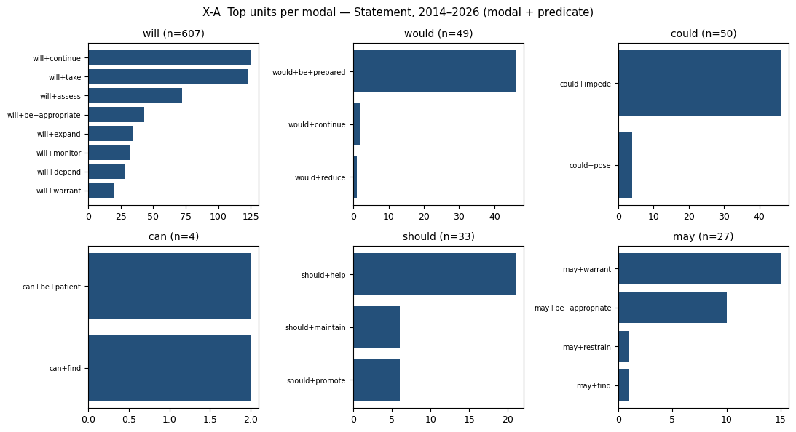
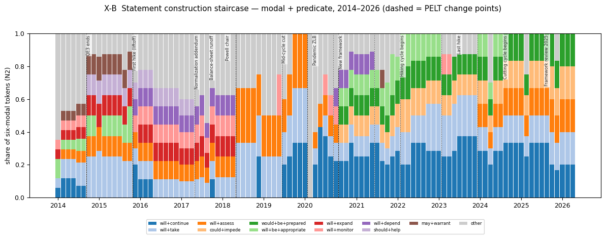
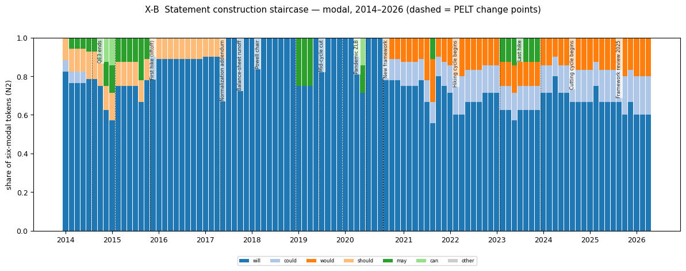
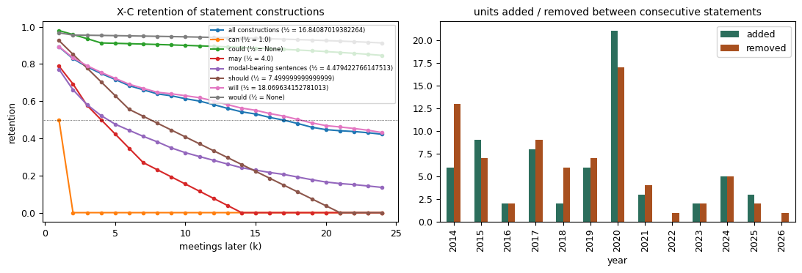
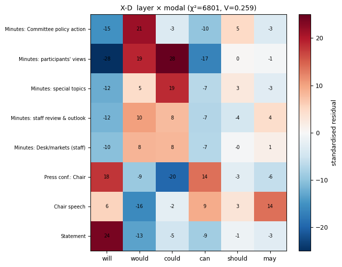
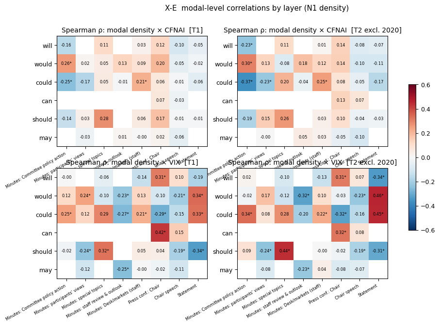
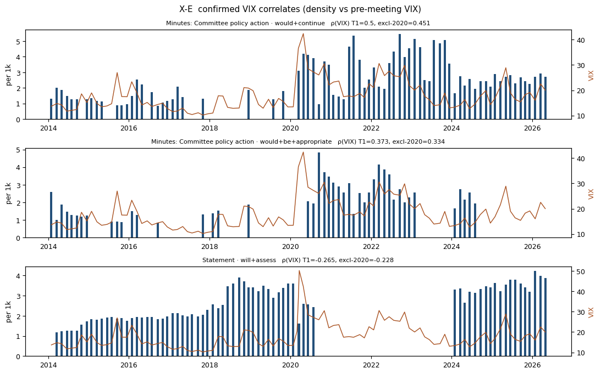
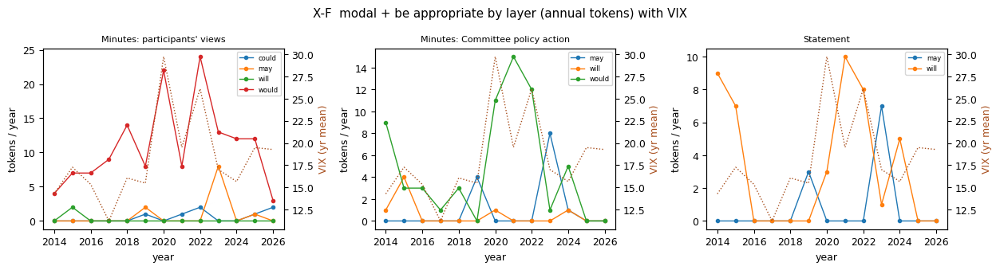

# 0. 한 장 요약

**목적.** 9월 4일 미팅에서 지도교수님이 요구한 것은 세 가지였다. ① 논문의 질문을 하나로 — *조동사(구문)가 경제 상황을 설명하는가, 못 하는가* — 좁히고 한 문장으로 답할 것, ② RQ1–2에서 쓴 구문(modal + predicate) 단위를 끝까지 일관되게 쓸 것(특히 Figure 4의 구문판), ③ 논문 형식이 아니라 **여러 결과를 나란히 놓은 보고서**로 볼 것. 팀 피드백은 데이터 정규화·무결성, 실험 일관성, 일본 절 축소, 의사록 포함 여부였다. 이 보고서는 데이터를 층위(장르 × 귀속)까지 다시 정제하고(v3), 코퍼스 정의 6종 × 분석 단위 3종 = 18개 시나리오를 같은 코드로 돌려, 각 결과가 무엇을 말하는지 적은 것이다.

**데이터에서 바뀐 것.** 기자회견 조동사의 19.7%가 기자 발화였고(could 48%, might 50%), 의사록 조동사의 21%가 인용된 성명서·규정문·표결·명단에서 나왔다. v3는 이를 화자·섹션 층위로 분리했다. 분리 검증: 의사록 안에 인용된 성명서와 성명서 원문의 문장집합 Jaccard 중앙값 0.94.

**모든 시나리오에서 성립하는 것.**

1. **Kawamura형 반경기 양태는 없다.** 어떤 장르·층위에서도 총 조동사 밀도가 실물 활동(CFNAI)과 유의하게 음의 관계가 아니다. 의장 기자회견 발화는 오히려 순경기적(ρ = +.26)이고 불확실성(VIX)과도 같이 움직인다(+.30).
2. **성명서의 조동사 구성은 계단이다.** 구문 단위 변화점 25개 중 17개가 정책 사건 ±1회의 안에 있고, 각 계단은 문장 하나의 삽입·삭제로 귀속된다. 구문 보유율 반감기는 16.8회의.
3. **성명서만으로는 거시 연계를 말할 수 없다.** 성명서 단독 시나리오(S1)의 확정 신호는 0–1개. 성명서 would/could × VIX의 +.45는 2020-09 문장 채택이 만든 시대 구성 효과다.
4. **선행지표가 아니다.** Granger 검정은 어떤 시나리오에서도 FDR을 통과하지 못한다.

**설정에 따라 달라지는 것 — 팀이 고를 부분.**

- 의사록을 넣으면 확정 신호가 위원회 결정 서술 층(`min_committee`)과 스태프 리뷰 층(`min_staff`)에서 나온다: `would be appropriate`(위원회) × CFNAI +.39 · × VIX +.33, `would assess` × CFNAI −.43, `could` × CFNAI −.37, 스태프 총밀도 × VIX −.36.
- 교수님의 "will은 왜 안 나오나" 질문: `would be appropriate`의 거시 상관은 참가자 심의 층이 아니라 **위원회 결정 서술 층**이 실어 나른다. will/would 차이는 "성명서 가이던스 문장의 조동사 vs 위원회 결정 서술의 조동사"다. v2의 "살아있는 심의 관용구" 해석은 수정해야 한다.
- v2 헤드라인 "의사록 can × VIX"는 사라졌다. 84개 토큰 중 21개가 1월 규정문·참석자 명단이었고, 층위 분리 후 적격 계열이 없다.

**추천.** 메인 시나리오 S4 × 구문(U2), 비교 열 S1(성명서만)·S2(성명서 + 위원회 층). 한 문장 주장은 **C2(편집 우선)를 축으로 C1(불확실성·구문 특이)을 결합**: *성명서의 조동사 변화는 정책 사건에 따른 정형문 편집의 계단이며, 경제 상황과의 공변은 편집되지 않은 의사록 층의 특정 구문에서만 나타난다 — 총량으로는 실물과 무관하고, 위원회 결정 서술은 실물·불확실성 모두와, 스태프 서술은 불확실성과 정합한다.*

---

# 1. 배경: 회의에서 요구된 것

| 요구 | 출처 | 이 보고서에서의 대응 |
|---|---|---|
| 연구질문 하나: 조동사가 경제 상황을 설명하는가 | 교수님 14:51 | §5 구문 × 거시, §7 주장 후보 |
| 구문 단위를 끝까지: Figure 4 구문판 | 교수님 02:15–03:00, 08:52 | §4.2 계단(구문판 vs 조동사판) |
| 한 문장 결론, "됐다/안 됐다" 정리 | 교수님 07:36–08:04 | §0, §7 |
| Figure 5 이후(보유율·거시 히트맵·시차) 단순화 | 교수님 09:xx | §4.3 지표 1개, §5.4 부록 수준 |
| will vs would 비대칭 설명 | 교수님 13:19 | §5.3 |
| be appropriate 선행연구 | 교수님 11:22 | §9 문헌 과제 |
| 일본 절은 인용 수준 | 교수님 17:39–17:46 | §7(논문 구조안) |
| 의사록 포함 명분 | 교수님 18:17–18:28 | §6 |
| 코로나 포함·제외 병기 | 교수님 19:27–20:01 | 모든 거시 표에 T1/T2 병기 |
| 보고서 형식, 여러 결과 비교, 웹 열람 | 교수님 19:13, 참석자 3 | 이 문서 + `results/report/` |
| 데이터 정규화·무결성 | 팀 피드백 1 | §2 |
| 실험 일관성 | 팀 피드백 2 | §3 시나리오 축 |
| 경제학 저널 지향 | 교수님 26:55 | §7 구조안, §8 지표 근거 |

---

# 2. 데이터 v3: 층위 인식 코퍼스

## 2.1 무엇을 고쳤나

| 문제 (v2) | 조치 (v3) | 효과 |
|---|---|---|
| 기자회견의 기자·진행자 발화가 연준 발화로 집계 | 화자 마커(`CHAIR POWELL.`, `STEVE LIESMAN.`, `MICHELLE SMITH.`)로 턴 분절 → chair / journalist / moderator | 6대 조동사 13,221 → 의장 10,686 (기자 2,452, 진행자 83 제외) |
| 의사록의 스태프·참가자·위원회·규정문이 한 덩어리 | 소제목 카탈로그로 섹션 귀속(staff_desk / staff / participants / committee / special / vote / boilerplate / front_matter) | 7,081 → 실질 층 5,589 |
| 의사록 위원회 섹션 안에 성명서 전문이 인용됨(성명서와 이중 집계) | 인용 블록 분리(`statement_quote`, `directive_quote`) | 761 + 102 토큰 분리; 원문과 Jaccard .94 |
| 각주("Return to text"), 사이트 내비게이션, 연설 참고문헌·제목 블록 잔재 | 제거 규칙 추가 | 연설 3,507 → 3,203 |
| 정규화 기준 혼재(원시 수·밀도·점유율) | 층위별 분모 저장, 지표 용도 고정(§2.3) | 모든 표에 지표명 표기 |

## 2.2 코퍼스 (시나리오 S4, 2014-01 ~ 2026-04, 비회의 성명서 4건 제외)

| 층위 | 문서 | 토큰 | 6대 조동사 | per 1k |
|---|---:|---:|---:|---:|
| Statement | 101 | 41,906 | 770 | 18.4 |
| Minutes: Desk/markets (staff) | 99 | 71,942 | 553 | 7.7 |
| Minutes: staff review & outlook | 99 | 249,885 | 539 | 2.2 |
| Minutes: participants' views | 99 | 223,992 | 2,756 | 12.3 |
| Minutes: Committee policy action | 99 | 62,833 | 958 | 15.3 |
| Minutes: special topics | 40 | 40,777 | 783 | 19.2 |
| Press conf.: Chair | 80 | 533,106 | 10,686 | 20.0 |
| Chair speech | 124 | 234,853 | 3,203 | 13.6 |

교수님이 지적한 "성명서 780 vs 기자회견 13,000"의 개수 차이는 per 1k 밀도로 보면 18.4 vs 20.0으로 비슷하다. 다른 것은 **층위별 밀도의 격차**다: 스태프 리뷰 2.2, 참가자 견해 12.3, 위원회 결정 15.3 — 사실 서술 → 심의 → 결정으로 갈수록 조동사가 많아진다.

## 2.3 정규화 기준

| 지표 | 정의 | 용도 |
|---|---|---|
| N1 밀도 | 층위 토큰 1,000개당 단위 수 | 층위 비교, 거시 상관(기본) |
| N2 점유율 | 문서-층위의 6대 조동사 토큰 중 단위 비율 | 구성 변화, 성명서 계단 |
| N3 문서당 수 | 원시 수 | 성명서 전용(문서 길이 자체가 편집 결과) |

## 2.4 무결성 검사 요약 (`results/qa/QA_report.md`)
- 중복 문서 0, 날짜 오류 0. 인코딩 잔재 3문장, 각주 잔재 1문장(0.004%).
- 회의 정합: 성명서만 있는 날짜 2건(2020-03-03, 03-23 긴급회의), 의사록만 있는 날짜 1건(2012-10-23, 하루 차이).
- 의사록 99건 전부 핵심 5섹션 존재. 기자회견 80건 전부 의장 마커 인식, 미분류 선두 텍스트 0건. 기자 168명 식별.
- 사람 검증 표본 2종(`sample_speaker_roles.csv` 10문서 × 20턴, `sample_minutes_layers.csv`)은 **미완** — 채워야 한다.

---

# 3. 실험 설계

## 3.1 시나리오 축
- **S 코퍼스 정의**: S1 성명서만 · S2 성명서 + 의사록 위원회 층 · S3 성명서 + 의사록 실질 층 전부 · **S4 4장르(기자 제거, 귀속 라벨) = 권장안** · S5 의사록만 · S6 미정제(v2 방식, 기자·규정문·인용문 포함).
- **U 분석 단위**: U1 조동사 · **U2 modal + predicate(구문)** · U3 modal + 동사 의미 부류.
- **T 기간**(각 블록 안의 열): T1 2014–2026 · T2 2020 제외 · T3 2010–2026, 그리고 반기 H1 2014–2019 / H2 2021–2026(부호 검사용).
- **N 정규화**(각 블록 안의 열): N1 밀도 · N2 점유율 · N3 문서당 수.

## 3.2 실험 블록 (모든 시나리오 동일)
X-A 구문 인벤토리 → X-B 성명서 구문 계단(PELT 변화점 + 원인 문장) → X-C 보유율·편집 이벤트 → X-D 층위 분업(χ², 화용 대조) → X-E 구문 × 거시(전수 스크린 + 사전 지정 표 + HAC) → X-F be appropriate → X-G 선행성(부록).

## 3.3 "확정(confirmed)" 규칙 — v2 적대적 검증을 규칙으로 고정
단위 × 거시변수 상관이 **확정**이려면 Spearman이 T1과 T2(2020 제외)에서 모두 p < .05·같은 부호이고, H1(2014–19)·H2(2021–26) 반기에서도 같은 부호이며, 토큰 ≥ 40·제로 회의 ≤ 60%여야 한다. T1에서만 유의하면 **T1-only(2020 의존)**, T1·T2는 유의하지만 반기 부호가 어긋나면 **시대 구성 효과**(문장 채택 사건이 만든 상관)로 분류한다.

## 3.4 거시 지표
주검정 = CFNAI 3개월 이동평균(회의 월 −2, 실시간 래그) + VIX(회의 전 28일 평균). 선택 근거와 대안 지표를 채택하지 않은 이유는 §8과 `docs/10`.

---

# 4. 결과 I — 언어 구조 (설정에 무관하게 성립)

## 4.1 X-A 구문 인벤토리: 층위마다 조동사는 다른 일을 한다

| 층위 | will | would | could | should | may |
|---|---|---|---|---|---|
| Statement (770) | continue 21%, take 20%, assess 12% | **be prepared 94%** | **impede 92%** | help 64% | warrant 56%, be appropriate 37% |
| Minutes 위원회 결정 (958) | take 30%, be appropriate 19% | continue 15%, take 12%, be appropriate 9% | impede 55% | help 24%, affirm 16% | warrant 45%, be appropriate 42% |
| Minutes 참가자 견해 (2,756) | depend 17% | be appropriate 9%, continue 7%, depend 4% | lead 7%, result 3%, help 3% | continue 11%, monitor 5% | be appropriate 7%, contribute 4% |
| Minutes 스태프 리뷰 (539) | incorporate 19% | expand 9%, increase 8%, remain 6% | increase 16%, prove 8% | (5개) | edge 32%, be lower 16% |
| 기자회견 의장 (10,686) | continue 6%, have 5%, see 4% | **say 21%**, like 4% | see 4%, have 4% | do 5%, help 4% | be 8% |
| 연설 (3,203) | continue 7%, discuss 5% | like 9%, expect 3% | have 4%, help 3% | take 3% | use 5% |

**이 표가 말하는 것.** 성명서에서 조동사 하나는 구문 하나다(would = be prepared, could = impede). 위원회 결정 서술은 성명서 문장을 과거형으로 되풀이하고(would take, could impede), 참가자 견해는 심의(would be appropriate, could lead), 스태프 리뷰는 전망(would expand, could increase, may edge), 의장 발화는 화자 표지(would say, can do)다. 조동사만 세면 이 분업이 모두 하나의 수치로 뭉개진다 — 구문 단위를 끝까지 써야 하는 이유(교수님 요구 A·D).



## 4.2 X-B 성명서 구문 계단 — 메인 결과 (Figure 4 구문판)





구문 단위에서 PELT 변화점 25개 중 **17개(68%)가 정책 사건 ±1회의 안**에 있고, 조동사 단위에서는 14개 중 10개다. 계단마다 원인 문장이 하나씩 붙는다.

| 구문 | 변화점 | 점유율 전→후 | 사건(거리) | 원인 문장 |
|---|---|---|---|---|
| should+help | 2014-10-29 | .00→.13 | QE3 종료(0일) | "This policy, by keeping the Committee's holdings … should help maintain accommodative financial conditions." |
| should+help | 2017-06-14 | .11→.00 | 정상화 부속서(0일) | 위 문장 삭제 |
| may+warrant | 2014-10-29 / 2015-12-16 | .05→.13 / .12→.00 | QE3 종료 / 첫 인상 | "economic conditions may, for some time, warrant keeping the target …" 도입·삭제 |
| will+be+appropriate | 2015-12-16 | .12→.00 | 첫 인상(0일) | "it likely will be appropriate to maintain the 0 to 1/4 percent …" 삭제 |
| will+monitor / will+depend / will+warrant | 2015-12-16 | .00→.11 | 첫 인상(0일) | 인상 후 가이던스 문장 3개 도입 |
| will+expand / monitor / depend / warrant | 2018-06-13 | .12→.00 | Powell 의장(128일) | 2018-06 성명서 축약(문장 4개 삭제) |
| will+take / will+assess | 2018-06-13 | .12→.29 | | 축약으로 점유율 상승(구성 효과) |
| will+continue | 2019-07-31 | .03→.26 | 중간 인하(0일) | "it will continue to monitor the implications of incoming information …" |
| will+take / assess | 2020-03-03 | .28→.08 | 팬데믹 ZLB(12일) | 긴급 성명서로 문장 교체 |
| will+depend | 2020-07-29 / 2021-07-28 | .00→.12 / .12→.00 | | "The path of the economy will depend significantly on the course of the virus." |
| would+be+prepared, could+impede | 2020-09-16 | .00→.12 | 새 프레임워크(20일) | "The Committee would be prepared to adjust … if risks emerge that could impede …" |
| will+be+appropriate | 2020-09-16 / 2023-03-22 | .00→.12 / .17→.02 | 새 프레임워크 / 마지막 인상 | "expects it will be appropriate to maintain this target range until …" 도입·삭제 |
| will+take | 2022-03-16 | .12→.22 | 인상 개시(0일) | "The Committee's assessments will take into account … readings on public health …" |
| will+assess | 2024-01-31 | .00→.15 | | "the Committee will carefully assess incoming data, the evolving outlook, and the balance of risks." |

**이 결과가 말하는 것.** 세미나의 출발 관찰(should 소멸, will 점유율 하락, would/could 등장)은 전부 여기 있다. should는 2017-06 재투자 문장 삭제로, would/could는 2020-09 조건부 약속 문장 채택으로, will 점유율 하락은 그 문장의 등장에 따른 구성 효과로 설명된다. 조동사 통계는 경기 반응이 아니라 **편집 결정의 흔적**이다. 이것이 논문의 첫 번째 축이 되어야 한다(교수님 G: "계단식이 가장 할 말이 많다").

## 4.3 X-C 지속성: 반감기 하나로 충분하다



| 지표 | 값 |
|---|---|
| 구문 집합 보유율 반감기 | **16.8회의** (will 18.1, should 7.5, may 4.0, can 1.0, would/could ≥ 24) |
| 조동사 문장 보유율 반감기 | 4.5회의 |
| 편집 이벤트(삽입/삭제) | 2014: 6/13 · 2015: 9/7 · 2016: 2/2 · 2017: 8/9 · 2018: 2/6 · 2019: 6/7 · **2020: 21/17** · 2021: 3/4 · 2022: 0/1 · 2023: 2/2 · 2024: 5/5 · 2025: 3/2 |

**말하는 것.** 성명서 구문은 평균 17회의(약 2년) 동안 유지되고, 편집은 국면 전환 해(2014, 2020)에 몰린다. v2의 KM 생존·AR(1) 반감기는 본문에서 빼고 이 지표 하나만 쓴다(교수님 "5부터는 이해 못함").

## 4.4 X-D 층위 분업과 화용 대조



| 층위 | 과대 사용(잔차) | 과소 사용 |
|---|---|---|
| Statement | will +23.8 | would −13.3 |
| Minutes 위원회 결정 | would +21.4, should +4.9 | will −15.1 |
| Minutes 참가자 견해 | could +28.4, would +19.0 | will −28.2, can −16.7 |
| Minutes 스태프 리뷰 | would +10.4, could +7.8, may +4.4 | will −11.7 |
| 기자회견 의장 | will +17.8, can +13.8 | could −19.5 |
| 연설 | may +13.8, can +9.2 | would −16.0 |

화용 대조(will/would/can/could, 비율):

| 층위 | 조동사 | n | 보고 동사 내포 | 조건절 | 주어 we/I | 주어 Committee/Fed | 주어 경제 | 부정 |
|---|---|---:|---:|---:|---:|---:|---:|---:|
| Statement | will | 607 | .23 | .04 | .00 | .46 | .23 | .00 |
| Statement | would / could | 49 / 50 | .04 / .08 | **.94 / .92** | .00 | .94 / .00 | .00 / .08 | .00 |
| Minutes 참가자 | would | 1,537 | **.71** | .18 | .00 | .02 | .40 | .02 |
| Minutes 참가자 | could | 875 | .51 | .29 | .00 | .03 | .30 | .01 |
| 기자회견 의장 | will | 4,341 | .20 | .16 | **.42** | .02 | .14 | .04 |
| 기자회견 의장 | would | 3,127 | .17 | .23 | **.56** | .01 | .05 | .10 |
| 기자회견 의장 | can | 1,610 | .15 | .20 | .40 | .01 | .06 | **.17** |
| 기자회견 의장 | could | 626 | .14 | .29 | .16 | .01 | .10 | .04 |

**말하는 것.** 성명서 would/could는 한 조건문(if … could impede)의 조동사이고, 참가자 층 would/could는 보고문 속 백시프트(participants judged that it would …)이며, 의장의 would/can은 1인칭 화자 표지(I would say, we can't)다. will/would가 "비슷하게 가고" can/could가 화용적으로 다르다는 교수님 발언 Q의 검토 재료: 의장 발화에서 would는 we/I 주어 56%·부정 10%, can은 we/I 40%·부정 17%·2인칭 25%로 **can만 청자 지향·부정 지향**이다.

---

# 5. 결과 II — 구문 × 거시 (설정에 따라 달라짐)

## 5.1 Kawamura 검정: 총 조동사 밀도는 경기를 설명하지 않는다

| 장르(층위) | ρ × CFNAI T1 / T2 / T3 | ρ × VIX T1 / T2 / T3 |
|---|---|---|
| Statement | −.12 / −.18 / −.10 | +.06 / +.05 / −.12 |
| Minutes(실질 층 합) | +.08 / +.15 / +.09 | +.07 / −.01 / −.07 |
| 기자회견 의장 | **+.22 / +.26\* / +.14** | **+.32\*\* / +.30\* / +.29\*\*** |
| 연설 | −.10 / −.07 / −.13 | −.02 / −.07 / −.01 |
| Minutes 스태프 리뷰 층(T2) | +.09 | **−.36\*\*\*** |
| Minutes 위원회 층(T2) | −.02 | +.10 |
| Minutes 참가자 층(T2) | −.01 | +.06 |

\* p<.05, \*\* p<.01, \*\*\* p<.001. Spearman, N1 밀도.

**말하는 것.** 일본(BoJ 월보)에서 보고된 "경기가 나쁠 때 양태 표현 증가"는 FOMC 어디에도 없다. 의장의 기자회견은 활동이 강하고 시장이 불안할수록 조동사가 많다(순경기 + 불확실성 동행). 스태프 리뷰는 불확실할수록 조동사가 **줄어든다**(사실 서술로 후퇴). 정제 전(S6)에도 부호는 같으므로 이 결론은 데이터 정제에 의존하지 않는다. 논문의 "실물이 아니다"는 유지되지만, "불확실성이다"는 층위를 지정해서만 말할 수 있다.



## 5.2 확정된 구문 (S4_U2, 층위 수준, 반기 부호 검사 통과)

| 층위 | 구문 | 거시 | ρ T1 | ρ 2020 제외 | ρ 2010– | ρ 2014–19 | ρ 2021–26 | 토큰 | 제로 회의 |
|---|---|---|---:|---:|---:|---:|---:|---:|---:|
| Minutes 위원회 | would+continue | VIX | +.50 | +.45 | +.32 | +.06 | +.08 | 109 | .22 |
| Minutes 위원회 | would+assess | CFNAI | −.49 | −.43 | −.39 | −.38 | −.39 | 49 | .52 |
| Minutes 위원회 | would+depend | CFNAI | +.43 | +.40 | +.37 | +.60 | +.34 | 51 | .59 |
| Minutes 위원회 | **would+be+appropriate** | CFNAI | +.41 | +.39 | +.40 | +.22 | +.54 | 63 | .55 |
| Minutes 위원회 | **would+be+appropriate** | VIX | +.37 | +.33 | +.29 | +.15 | +.38 | 63 | .55 |
| Minutes 위원회 | could (전체) | CFNAI | −.25 | −.37 | −.13 | −.41 | −.55 | 83 | .29 |
| Minutes 위원회 | would (전체) | CFNAI | +.26 | +.30 | +.27 | +.33 | +.28 | 719 | .00 |
| Minutes 스태프 | 전체 밀도 | VIX | −.33 | −.36 | −.39 | −.20 | −.23 | 539 | .00 |
| Minutes 스태프 | would (전체) | VIX | −.23 | −.32 | −.27 | −.26 | −.01 | 327 | .07 |
| Minutes 데스크 | could (전체) | CFNAI / VIX | +.21 / +.21 | +.25 / +.22 | +.18 / +.15 | +.24 / +.13 | +.27 / +.41 | 138 | .43 |
| Minutes 참가자 | should (전체) | VIX | −.24 | −.24 | −.29 | −.09 | −.16 | 149 | .28 |
| Statement | will+assess | VIX | −.27 | −.23 | −.32 | −.07 | −.27 | 72 | .29 |
| 연설 | should (전체) | VIX | −.19 | −.19 | −.06 | −.04 | −.16 | 210 | .45 |

HAC 회귀(Newey–West 4 lag, T2, 밀도 ~ CFNAI + VIX)로 본 위원회 층: would+be+appropriate — VIX +.095 (p = .007), CFNAI +1.86 (p < .001); would+depend — CFNAI +1.61 (p = .03), VIX −.085 (p = .001); would+assess — CFNAI −1.78 (p = .002).



**말하는 것.** 신호는 **의사록 위원회 결정 서술**에 있다. 활동이 강한 회의에서 위원회는 "it would be appropriate to [raise/adjust]" · "would depend on"을 더 쓰고, "would assess"·"could"를 덜 쓴다 — 결정을 내리는 회의와 지켜보는 회의의 언어 차이다. 스태프 리뷰는 불확실할수록 조동사를 줄인다. 이 두 층은 회의마다 새로 쓰이는, **편집되지 않은** 텍스트다. 반면 성명서 층에서 확정된 것은 will+assess × VIX 하나뿐이고 그마저 2014–19 반기에서는 −.07이다.

## 5.3 will vs would + be appropriate (교수님 질문 I)

| 층위 | 구문 | n | ρ VIX T1 / T2 | ρ CFNAI T1 / T2 | 제로 회의 |
|---|---|---:|---|---|---:|
| Minutes 위원회 | would+be+appropriate | 63 | **+.37 / +.33** | **+.41 / +.39** | .55 |
| Minutes 참가자 | would+be+appropriate | 143 | +.21 / +.15 (n.s.) | −.05 / +.01 | .23 |
| Minutes 특별 | would+be+appropriate | 23 | +.22 / +.33 (p = .05) | +.29 / +.27 | .60 |
| Statement | will+be+appropriate | 43 | +.24 / +.29 | +.36 / +.30 | .61 |
| 기자회견 의장 | will+be+appropriate | 105 | −.05 / +.01 | +.20 / +.12 | .42 |
| Minutes 위원회 | will+be+appropriate | 7 | — | — | .93 |



**답.** (1) will be appropriate는 성명서 가이던스 문장("expects it will be appropriate to maintain …")의 조동사로, 2014–15·2020-09~2023-03 두 국면에만 존재하는 계단이다(제로 회의 61%). (2) would be appropriate의 거시 상관은 위원회 결정 서술("members judged/agreed that it would be appropriate to …")이 실어 나르고, 토큰이 가장 많은 참가자 층(143)에서는 약하다. (3) 따라서 will/would 차이는 시제도, "심의 vs 지침"도 아니라 **"성명서에 실리는 약속(will)" vs "의사록에 기록되는 결정 서술(would)"**의 차이다. 결정 서술은 실제로 정책이 조정된 회의에 몰리고 그 회의는 활동·불확실성이 높은 회의이므로 CFNAI·VIX 모두와 정합한다. v2의 "살아있는 심의 관용구" 문단은 이렇게 고쳐 써야 한다.

## 5.4 시대 구성 효과와 2020 의존 — 무엇이 걸러졌나

| 층위 | 구문 | 거시 | ρ T1 / T2 | ρ 2014–19 / 2021–26 | 판정 |
|---|---|---|---|---|---|
| Statement / 위원회 | would+be+prepared, could+impede | VIX | +.36 / +.47 | 없음 / −.01 | 2020-09 채택 사건(시대 구성) |
| Statement | would, could (전체) | VIX | +.34 / +.45 | −.22 / −.05 | 시대 구성 |
| Statement | will+continue | VIX | +.41 / +.40 | +.08 / **−.33** | 시대 구성(2019-07 채택) |
| 기자회견 의장 | can (전체) | VIX | +.42 / +.32 | 반기 불일치 | 시대 구성 |
| Minutes 참가자 | would+help | VIX | +.42 / +.43 | 반기 불일치 | 시대 구성 |
| Statement | will+assess | CFNAI | −.36 / −.30 | | 반기 불일치 |

**말하는 것.** v2 서론의 경고("한 문장이 한 번 채택되면 상관이 생긴다")가 규칙으로 작동한다. 성명서에서 VIX와 가장 강하게 상관하는 구문들은 전부 채택 사건의 산물이다. 이것이 C2(편집 우선) 주장의 직접 증거다.

## 5.5 X-G 선행성 (부록 수준)
- 교차상관 피크(2020 제외, Pearson·Spearman 동시 유의): 의사록 could → CFNAI k = +6 (ρ −.27), 의사록 would+be+appropriate × VIX k = +2 (+.26) · × CFNAI k = −3 (+.31), would+continue × VIX k = −6 (+.39). 대부분 macro→text 방향이거나 약하다.
- Granger(lag 2, 양방향): 18개 시나리오 모두에서 text→macro가 FDR q < .10을 통과하지 못함(S4_U2 최소 q = .74).
- **말하는 것.** 조동사 구문은 상태 변수이지 예측 변수가 아니다. 논문 본문에서 빼고 부록 한 문단으로.

---

# 6. 시나리오 비교 — 무엇이 결론을 바꾸는가

## 6.1 격자

| 시나리오 | 단위 | 계단 변화점(사건 ±1회의) | 반감기 | 확정 VIX | 확정 CFNAI | 2020 의존 | 시대 구성 | ρ 총밀도×CFNAI stmt / min / pc | ρ 총밀도×VIX stmt / min / pc |
|---|---|---:|---:|---:|---:|---:|---:|---|---|
| S1 성명서만 | U1 조동사 | 14 (10) | ≥24 | 0 | 0 | 0 | 2 | -0.18 / — / — | +0.04 / — / — |
| S1 성명서만 | **U2 구문** | 25 (17) | 16.8 | 1 | 0 | 0 | 7 | -0.18 / — / — | +0.04 / — / — |
| S1 성명서만 | U3 동사 부류 | 26 (17) | ≥24 | 1 | 1 | 1 | 7 | -0.18 / — / — | +0.04 / — / — |
| S2 성명서+위원회 층 | U1 조동사 | 14 (10) | ≥24 | 0 | 2 | 0 | 3 | -0.18 / -0.02 / — | +0.04 / +0.10 / — |
| S2 성명서+위원회 층 | **U2 구문** | 25 (17) | 16.8 | 3 | 5 | 0 | 12 | -0.18 / -0.02 / — | +0.04 / +0.10 / — |
| S2 성명서+위원회 층 | U3 동사 부류 | 26 (17) | ≥24 | 3 | 5 | 2 | 12 | -0.18 / -0.02 / — | +0.04 / +0.10 / — |
| S3 성명서+의사록 실질 층 | U1 조동사 | 14 (10) | ≥24 | 4 | 3 | 2 | 5 | -0.18 / +0.15 / — | +0.04 / -0.01 / — |
| S3 성명서+의사록 실질 층 | **U2 구문** | 25 (17) | 16.8 | 7 | 6 | 4 | 14 | -0.18 / +0.15 / — | +0.04 / -0.01 / — |
| S3 성명서+의사록 실질 층 | U3 동사 부류 | 26 (17) | ≥24 | 10 | 8 | 7 | 15 | -0.18 / +0.15 / — | +0.04 / -0.01 / — |
| **S4 4장르 정제(권장)** | U1 조동사 | 14 (10) | ≥24 | 5 | 3 | 2 | 10 | -0.18 / +0.15 / +0.26* | +0.04 / -0.01 / +0.30* |
| **S4 4장르 정제(권장)** | **U2 구문** | 25 (17) | 16.8 | 8 | 6 | 10 | 25 | -0.18 / +0.15 / +0.26* | +0.04 / -0.01 / +0.30* |
| **S4 4장르 정제(권장)** | U3 동사 부류 | 26 (17) | ≥24 | 13 | 9 | 15 | 30 | -0.18 / +0.15 / +0.26* | +0.04 / -0.01 / +0.30* |
| S5 의사록만 | U1 조동사 | — | — | 4 | 3 | 2 | 3 | — / +0.15 / — | — / -0.01 / — |
| S5 의사록만 | **U2 구문** | — | — | 6 | 6 | 4 | 7 | — / +0.15 / — | — / -0.01 / — |
| S5 의사록만 | U3 동사 부류 | — | — | 9 | 7 | 6 | 8 | — / +0.15 / — | — / -0.01 / — |
| S6 미정제(v2 방식) | U1 조동사 | 14 (10) | ≥24 | 5 | 5 | 3 | 16 | -0.09 / +0.16 / +0.27* | -0.08 / -0.12 / +0.28* |
| S6 미정제(v2 방식) | **U2 구문** | 25 (17) | 16.8 | 9 | 8 | 11 | 39 | -0.09 / +0.16 / +0.27* | -0.08 / -0.12 / +0.28* |
| S6 미정제(v2 방식) | U3 동사 부류 | 26 (17) | ≥24 | 14 | 12 | 18 | 44 | -0.09 / +0.16 / +0.27* | -0.08 / -0.12 / +0.28* |

읽는 법: 확정 = 층위 수준 전수 스크린에서 T1·T2(2020 제외) 유의·동부호이고 2014–19/2021–26 반기 부호도 같은 단위 수(조동사 수준 포함). 2020 의존 = T1에서만 유의. 시대 구성 = T1·T2 유의하나 반기 부호 불일치. ρ = 장르 총 조동사 밀도와의 Spearman(2020 제외), * p<.05.

## 6.2 각 축이 바꾸는 것

**의사록 포함 (S1 → S2 → S3).** 성명서만(S1)에서는 확정 신호가 0–1개다. 위원회 층만 더해도(S2) 위의 핵심 구문(would be appropriate·assess·depend, could)이 전부 나타난다. 스태프·참가자 층을 더하면(S3) 스태프 총밀도 × VIX(−.36)와 참가자 should × VIX(−.24)가 추가된다. **의사록 없이는 "경제 상황을 설명하는가"에 답할 표본이 없다.** 반대로 의사록만(S5)으로는 계단·반감기(성명서 고유)를 잃는다.

**기자 발화 제거 (S6 → S4).** 총밀도 상관의 부호는 바뀌지 않지만, 2020 의존·시대 구성 적중이 줄고(S6_U2 11/39 → S4_U2 10/25), S6에서만 나오는 확정 단위 3개는 전부 제외 층(표결, 인용 성명서)에서 나온 인공물이다. v2의 기자회견 Granger 결과(can→VIX q = .040)는 기자 발화 제거 후 사라졌다.

**단위 (U1 → U2 → U3).** 구문(U2)이 조동사(U1)보다 계단을 더 많이·정확히 잡고(25/17 vs 14/10), 성명서·위원회 층에서 조동사 수준에는 없는 신호를 드러낸다(would be appropriate는 would 전체 +.30보다 강한 +.39). 동사 부류(U3)는 적중이 가장 많지만 시대 구성도 가장 많다(스크린이 넓어서). 본문 U2, 비교 열 U1, 부록 U3.

**코로나 (T1 vs T2).** 2020을 빼면 성명서 층의 VIX 상관은 오히려 커지고(would/could +.34 → +.45) 반기 검사에서 죽는다 — 즉 문제는 2020의 극단값이 아니라 **2020-09의 문장 채택**이다. 교수님 방침대로 두 열을 병기하되, "코로나 시기 반응"으로 서술할 것은 2020-03 긴급 성명서의 will+take/assess 급락(계단) 정도다.

---

# 7. 주장 후보와 추천

| 후보 | 한 문장 | 지지 조건 | S1 | S2 | S3 | S4 |
|---|---|---|---|---|---|---|
| C1 긍정·조건부 | 실물이 아니라 불확실성, 그것도 특정 구문에서만 | 반경기 없음 ∧ VIX 확정 ≥ 1 ∧ 구문 > 조동사 | 부분 | 부분 | 지지 | 지지 |
| **C2 편집 우선** | 성명서 조동사 변화는 편집의 흔적, 거시 공변은 비편집 층에서만 | 계단 ≥ 50% 사건 일치 ∧ 성명서 층 확정 VIX ≈ 0 ∧ 의사록 확정 ≥ 1 | — | 지지 | 지지 | 지지 |
| C3 부정·명확 | 조동사를 세는 것으로는 경제 상황을 읽을 수 없다 | 조동사 수준 확정 0 ∧ 반경기 없음 | 지지 | 부분 | 기각 | 기각 |

**추천.** 메인 S4_U2, 비교 S1_U2·S2_U2. 주장은 C2를 축으로 C1을 결합하되, v3 결과에 맞게 "실물 아님"을 다듬는다: *총량으로는 실물·불확실성 어느 쪽과도 무관하고, 위원회 결정 서술 구문은 실물·불확실성 모두와, 스태프 서술은 불확실성과 정합한다.* 논문 구조(경제학 저널, RQ 5→3): 1 서론(질문 하나) → 2 데이터(층위·정제) → 3 구문 인벤토리(짧게) → **4 성명서 구문 계단** → **5 구문과 거시 환경(층위별, T1/T2 병기, will/would)** → 6 논의(Kawamura 인용 2–3문장, 지표 설계 함의 1문단) → 부록(스크린·ledger·선행성·시나리오 강건성).

---

# 8. CFNAI·VIX를 쓰는 학술적 근거 (요약; 전문은 `docs/10`)

연구질문은 지표에 여섯 조건을 요구한다: (i) 회의 단위(6주)로 정렬 가능한 월별 이상 빈도, (ii) 회의 시점에 공개된 실시간 값, (iii) 실물 활동과 불확실성의 분리, (iv) 벤치마크(Kawamura et al., 2019: 경기 CI + VIX)와의 비교가능성, (v) 텍스트로 만든 지표가 아니어서 종속변수와 순환하지 않을 것, (vi) 연준 반응함수의 목표 변수(실업률·인플레이션)가 아니어서 성명서의 직접 언급과 기계적으로 상관하지 않을 것.

- **CFNAI**: 85개 월별 실물 지표의 제1 주성분(Stock & Watson, 1999 방법론), 시카고 연준 발표, 3개월 이동평균과 −0.7 침체 기준(Evans, Liu & Pham-Kanter, 2002). 성명서가 직접 인용하지 않는 광범위 활동 지수(vi)이며, 일본 내각부 CI의 미국 대응물(iv). 회의 월 −2 래그로 실시간성(ii) 확보.
- **VIX**: 옵션 내재변동성(Whaley, 2009)으로 불확실성 충격의 표준 측정치(Bloom, 2009)이고 통화정책과의 상호작용이 이론화됨(Bekaert, Hoerova & Lo Duca, 2013). Kawamura가 같은 변수를 통제로 사용(iv). 회의 전 28일 평균은 회의 당일 반응(내생성)을 제외한다.
- **채택하지 않은 것**: 실업률·근원 PCE 갭(반응함수 변수 → 강건성 전용), EPU·MPU(뉴스 텍스트 기반, 연준 발언이 지표에 들어감 → 순환성), JLN 거시 불확실성(발표 지연·개정), GDP(분기·개정), NFCI(VIX 포함 합성).

---

# 9. 의사록 포함 명분 (교수님 요구 L; 전문은 `docs/08` §4)

1. **연구질문이 요구한다** — 성명서는 회의당 340–840토큰, 12년 합계 770개의 조동사이고 조동사마다 문장 하나에 묶여 있다. S1 결과가 보여주듯 성명서만으로는 "설명한다/못 한다"를 통계적으로 말할 수 없다.
2. **같은 회의, 같은 위원회의 문서다** — 위원회 결정 서술은 성명서 문장을 되풀이하는 통제군이고, 참가자 견해는 심의를 기록한 유일한 문서다. 기자회견은 질문에 대한 반응, 연설은 회의와 비동기다.
3. **의사록 없이는 안 보이는 결과가 있다** — will/would 비대칭의 답(§5.3), 스태프 서술의 불확실성 반응(§5.1).
4. **경제학 문헌의 표준이다** — Hansen, McMahon & Prat(2018)의 심의 측정, Kawamura의 BoJ 월보(스태프 문서)와 비교 가능한 층은 의사록 스태프 리뷰다.
5. **투명성** — 층위 라벨을 붙이고 S1(성명서만)을 항상 병기하여, 포함이 결론을 바꾸는지 그대로 보인다.

minutes-only가 안 되는 이유: 세미나의 출발 관찰과 계단은 성명서 고유다.

---

# 10. v2 결과 중 수정할 항목

| v2 주장 | v3 결과 | 조치 |
|---|---|---|
| 의사록 can × VIX ρ = .46 (헤드라인) | 84개 중 21개가 1월 규정문·명단; 층위 분리 후 적격 계열 없음 | 삭제 |
| 의사록 would be appropriate = 살아있는 심의 신호 | 위원회 결정 서술 층(63)이 신호, 참가자 층(143)은 약함 | §5.3대로 재해석 |
| 기자회견 can→VIX, would→VIX Granger q = .040 | 기자 발화 제거 후 전부 FDR 탈락 | 삭제 |
| would expand 등 fair-weather 구문의 VIX 음(−)상관 | 스태프 리뷰 층 would/총밀도 × VIX 음(−)으로 층위가 바뀌어 재등장(−.32/−.36) | "스태프 전망 서술은 불확실할 때 줄어든다"로 재서술 |
| 총밀도 반경기성 없음 | 동일 | 유지 |
| 계단·반감기 | 동일, 구문판에서 더 선명 | Figure 4를 구문판으로 교체 |
| 통계 표기 | 확정/2020 의존/시대 구성의 3분류로 통일 | 부록 ledger 표 1개 |

---

# 11. 한계와 다음 단계

- **사람 검증 미완**: 화자 역할 표본(10문서 × 20턴), 의사록 층위 표본, 추출 정확도 200문장 2인 코딩. 투고 전 필수.
- **거시 지표 vintage**: CFNAI는 최종 개정치(ALFRED vintage 재검정은 향후 항목). VIX는 무개정.
- **관측치 수**: 회의 약 100회, 층위별 제로 회의가 많은 구문은 상관 자체가 불안정(제로 회의 ≤ 60% 규칙으로 제한).
- **2012-10-23 의사록**(2010 확장 기간)은 PDF 포맷으로 층위 미분류.
- **다음**: 팀이 시나리오(D10)·주장(D11)·의사록 명분 수용(D8)·코로나 표기(D9)를 정하면 Phase 13 논문 v3 작성. 문헌 보강: be appropriate(Van linden 2012; Femia, Friedman & Sack 2013), will/would vs can/could 화용론(Collins 2009; Ward, Birner & Kaplan 2003).

---

# 부록 A. 재현

```bash
.venv/bin/python experiments/10_build_corpus_v3.py     # 층위 코퍼스
.venv/bin/python experiments/11_extract_modals_v3.py   # 조동사 구문 추출
.venv/bin/python experiments/12_qa_integrity.py        # QA 리포트
.venv/bin/python experiments/13_run_scenarios.py --corpus all --unit all   # 18개 시나리오
.venv/bin/python experiments/14_build_report.py        # results/report/*.html
```

# 부록 B. 산출물 위치
- 시나리오별 표·그림·요약: `results/scenarios/<S>_<U>/` (README.md에 블록별 한 줄 결론)
- 비교 보고서(웹): `results/report/index.html`(격자), `claims.html`, `scenario_<S>_<U>.html`
- 데이터 카드 `docs/09`, 거시 지표 근거 `docs/10`, 결과 요약 `docs/11`, 회의 분석·전략 `docs/08`
